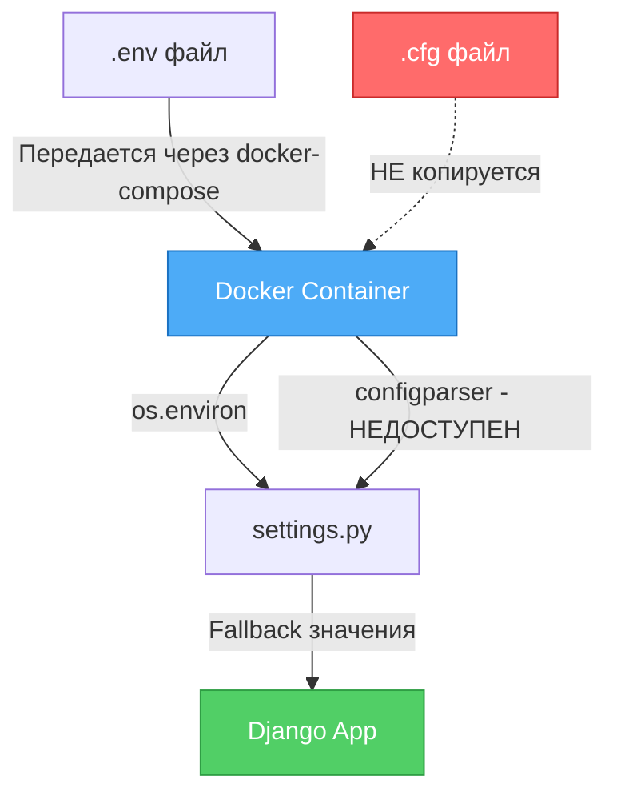
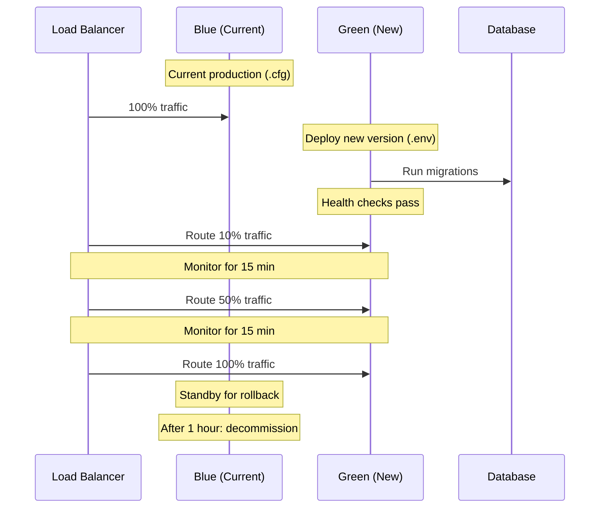
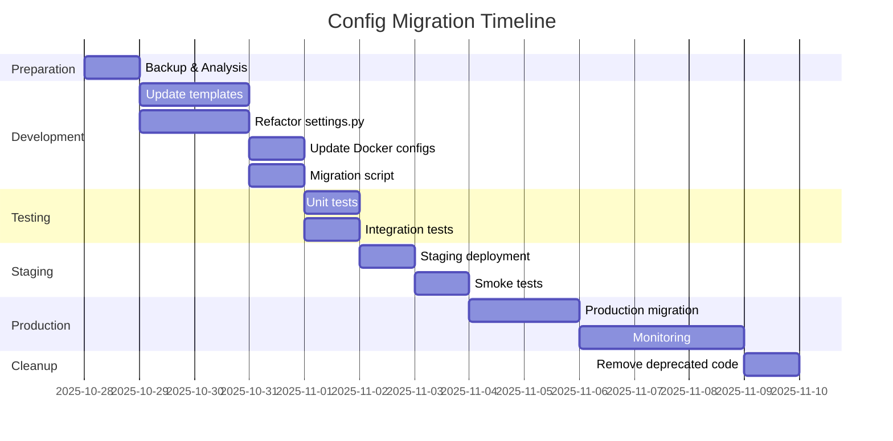

# Архитектурное решение по унификации конфигурации OK-Tools

> **Дата:** 2025-10-26  
> **Автор:** Architect Mode  
> **Статус:** Рекомендовано к реализации

---

## Executive Summary

**РЕКОМЕНДАЦИЯ: Вариант 1 - Полная миграция на .env**

**Критическая находка:** В текущей production-инфраструктуре `.cfg` файлы **не копируются и не монтируются в Docker контейнеры**, что означает, что приложение фактически уже работает только на fallback-значениях и переменных окружения. Гибридный подход существует только на бумаге.

**Ключевые аргументы:**
- ✅ Фактическое состояние уже близко к Варианту 1
- ✅ Соответствие 12-factor app methodology
- ✅ Нативная поддержка Docker/Kubernetes
- ✅ Единый источник правды (single source of truth)
- ✅ Упрощение deployment процесса
- ✅ Снижение операционных рисков

---

## 1. Анализ текущего состояния

### 1.1 Критические проблемы инфраструктуры

#### Проблема #1: .cfg файлы не используются в production

**Доказательства:**

1. **[`docker-compose.production.yml`](../docker-compose.production.yml:66-71)** - отсутствует volume для configs:
```yaml
volumes:
  - ./data/static:/app/static
  - ./data/media:/app/media
  - ./logs:/app/logs
  - ./backups:/app/backups
  - ./deployment:/app/deployment:ro
  # ❌ Отсутствует: - ./configs:/app/configs:ro
```

2. **[`docker-compose.production.yml`](../docker-compose.production.yml:39-60)** - `OKTOOLS_CONFIG_FILE` не передается:
```yaml
environment:
  - DJANGO_SETTINGS_MODULE=${DJANGO_SETTINGS_MODULE}
  - DJANGO_SECRET_KEY=${DJANGO_SECRET_KEY}
  # ... другие переменные
  # ❌ Отсутствует: - OKTOOLS_CONFIG_FILE=/app/configs/production.cfg
```

3. **[`install.sh`](../scripts/install.sh:112-113)** копирует configs локально, но они не доступны в контейнере:
```bash
mkdir -p "$PRODUCTION_DIR/configs"
cp -f deployment/configs/* "$PRODUCTION_DIR/configs/"
# ❌ Но volume не монтируется в docker-compose!
```

**Результат:** [`settings.py`](../../ok_tools/settings.py:30-33) выводит warning и использует fallback-значения:
```python
if "OKTOOLS_CONFIG_FILE" in os.environ:
    config.read_file(open(os.environ.get("OKTOOLS_CONFIG_FILE"), encoding="utf-8"))
else:
    logger.warning("No config file found for ok-tools. Switching to fallbacks.")
```

#### Проблема #2: Дублирование и несоответствия

Согласно [`config-comparison-bayern.md`](config-comparison-bayern.md:110-133):

| Параметр | .env формат | .cfg формат | Проблема |
|----------|-------------|-------------|----------|
| ALLOWED_HOSTS | `localhost,127.0.1,domain.com` | `domain.com www.domain.com` | Разные разделители |
| Redis | `REDIS_URL=redis://...` | `celery.broker_url` + `celery.result_backend` | Дублирование |
| LOG_LEVEL | `LOG_LEVEL=info` | `logging.level=INFO` | Разные имена и регистр |

#### Проблема #3: Отсутствующие переменные

**В .env.template отсутствуют:**
- `OKTOOLS_CONFIG_FILE` - путь к .cfg файлу
- `DJANGO_LOG_LEVEL` - уровень логирования Django (используется в [`settings.py:46`](../../ok_tools/settings.py:46))

**В .cfg отсутствуют:**
- `django.backup_dir` - директория бэкапов (используется в [`settings.py:283`](../../ok_tools/settings.py:283))

#### Проблема #4: Ошибки в .cfg файлах

1. **[`ok-bayern-production.cfg:83`](../configs/ok-bayern-production.cfg:83)** - синтаксическая ошибка:
```ini
bootstrap]  # ❌ Неправильно! Должно быть: [bootstrap]
```

2. **[`ok-bayern-production.cfg:154`](../configs/ok-bayern-production.cfg:154)** - неполный cron:
```ini
expire_rentals_schedule = */30 * *  # ❌ 3 поля вместо 5
```

### 1.2 Архитектурная схема (текущая)



---

## 2. Сравнительный анализ вариантов

### 2.1 Вариант 1: Полная миграция на .env ⭐ РЕКОМЕНДОВАНО

#### Описание
Перенести ВСЕ параметры из `.cfg` в `.env`, полностью отказаться от `.cfg` файлов, переписать [`settings.py`](../../ok_tools/settings.py:1) для чтения исключительно из `os.environ`.

#### Преимущества

✅ **Техническая реализуемость:**
- Фактически уже работает таким образом
- Минимальный разрыв с текущим состоянием
- Не требует изменений в Docker infrastructure

✅ **Стандартизация:**
- Соответствие [12-factor app](https://12factor.net/config)
- Best practice для Django в Docker
- Совместимость с Kubernetes/Cloud platforms

✅ **Операционная простота:**
- Единый источник конфигурации
- Легче управлять secrets (Docker secrets, Vault)
- Проще CI/CD pipelines

✅ **Безопасность:**
- .env файлы проще защитить (chmod 600)
- Легче интегрировать с secret management
- Меньше точек отказа

✅ **Maintenance:**
- Новым разработчикам понятнее
- Меньше файлов для управления
- Проще rollback при проблемах

#### Недостатки

❌ **Потеря структурирования:**
- Нет секций как в INI
- **Решение:** Использовать префиксы + комментарии

❌ **Объем работы:**
- Рефакторинг [`settings.py`](../../ok_tools/settings.py:1) (400+ строк)
- Обновление всех `.env.template`
- **Оценка:** 8-12 часов

❌ **Миграция:**
- Нужно обновить все существующие deployment'ы
- **Решение:** Миграционный скрипт

❌ **Многострочные значения:**
- Сложнее в .env (экранирование `\n`)
- **Решение:** Использовать JSON для сложных структур

### 2.2 Вариант 2: Улучшение гибридного подхода

#### Описание
Сохранить `.cfg` для сложных настроек, исправить дублирование, добавить монтирование `.cfg
` в контейнеры.

#### Преимущества

✅ **Минимальные изменения кода:**
- Сохранение текущей структуры [`settings.py`](../../ok_tools/settings.py:1)
- Не требует переписывания логики чтения
- **Оценка:** 2-4 часа

✅ **Структурированность:**
- Секции INI удобны для группировки
- Читаемость конфигурации

✅ **Быстрая реализация:**
- Просто добавить volumes и переменные
- Исправить баги в .cfg

#### Недостатки

❌ **Не решает основную проблему:**
- Два источника конфигурации
- Дублирование продолжается
- Больше complexity

❌ **Против best practices:**
- Не соответствует 12-factor
- Сложнее для cloud-native
- Хуже для secret management

❌ **Долгосрочные риски:**
- Запутанность для новых разработчиков
- Две точки отказа
- Сложнее поддержка

❌ **Критично:** НЕ решает факт, что система УЖЕ не использует .cfg!

### 2.3 Матрица сравнения

| Критерий | Вес | Вариант 1 (.env) | Вариант 2 (гибрид) |
|----------|-----|------------------|---------------------|
| **Соответствие текущему состоянию** | 🔴 | ⭐⭐⭐⭐⭐ (5/5) | ⭐⭐ (2/5) |
| **12-factor app compliance** | 🔴 | ⭐⭐⭐⭐⭐ (5/5) | ⭐⭐ (2/5) |
| **Docker/K8s compatibility** | 🔴 | ⭐⭐⭐⭐⭐ (5/5) | ⭐⭐⭐ (3/5) |
| **Операционная простота** | 🔴 | ⭐⭐⭐⭐⭐ (5/5) | ⭐⭐ (2/5) |
| **Secret management** | 🟡 | ⭐⭐⭐⭐⭐ (5/5) | ⭐⭐⭐ (3/5) |
| **Простота миграции** | 🟡 | ⭐⭐⭐ (3/5) | ⭐⭐⭐⭐ (4/5) |
| **Объем работы** | 🟢 | ⭐⭐⭐ (3/5) | ⭐⭐⭐⭐⭐ (5/5) |
| **Структурированность** | 🟢 | ⭐⭐⭐⭐ (4/5) | ⭐⭐⭐⭐⭐ (5/5) |
| **Долгосрочная поддержка** | 🔴 | ⭐⭐⭐⭐⭐ (5/5) | ⭐⭐ (2/5) |
| **Риски** | 🔴 | ⭐⭐⭐⭐ (4/5) | ⭐⭐ (2/5) |
| **ИТОГО (взвешенный балл)** | | **4.6 / 5.0** | **2.7 / 5.0** |

🔴 Критический вес (x2)  
🟡 Средний вес (x1.5)  
🟢 Низкий вес (x1)

---

## 3. Рекомендация и обоснование

### 3.1 Окончательная рекомендация

**⭐ РЕКОМЕНДУЕТСЯ: Вариант 1 - Полная миграция на .env**

### 3.2 Ключевые аргументы

#### 1. Фактическое состояние
Система УЖЕ работает без .cfg файлов в production. Мы не "ломаем" работающую систему, мы **фиксируем и улучшаем** то, что уже работает.

#### 2. Индустриальный стандарт
12-factor app - это не теория, а проверенная практика для production-приложений. Все современные cloud platforms (AWS ECS, GCP Cloud Run, Azure Container Apps, Kubernetes) ожидают конфигурацию через environment variables.

#### 3. Безопасность
Управление secrets через .env + secret managers (AWS Secrets Manager, HashiCorp Vault) - industry standard. Это критично для production.

#### 4. Операционная эффективность
Один источник правды = меньше ошибок = проще troubleshooting. DevOps команде не нужно синхронизировать два файла.

#### 5. Масштабируемость
При росте инфраструктуры (multiple environments, geo-distribution) .env + orchestration tools работают лучше чем .cfg файлы.

### 3.3 Риски и митигация

| Риск | Вероятность | Влияние | Митигация |
|------|-------------|---------|-----------|
| Ошибки при рефакторинге settings.py | Средняя | Высокое | Unit tests + staging deployment |
| Проблемы с многострочными значениями | Низкая | Среднее | JSON для сложных структур |
| Сложность миграции существующих деплоев | Средняя | Среднее | Миграционный скрипт + документация |
| Потеря данных конфигурации | Низкая | Критическое | Бэкапы .cfg перед миграцией |
| Downtime при обновлении | Низкая | Высокое | Blue-green deployment strategy |

---

## 4. Детальный план реализации

### 4.1 Общая стратегия

**Фазированный подход с zero-downtime:**
1. Подготовка (Phase 0)
2. Разработка (Phase 1)
3. Тестирование (Phase 2)
4. Staging deployment (Phase 3)
5. Production migration (Phase 4)
6. Cleanup (Phase 5)

### 4.2 Phase 0: Подготовка (1-2 часа)

#### Задачи:
- [ ] Создать feature branch `config/migrate-to-env`
- [ ] Сделать полный бэкап всех .cfg файлов
- [ ] Документировать текущее состояние всех deployment'ов
- [ ] Создать comparison matrix всех параметров .cfg → .env

#### Deliverables:
- `deployment/backup/configs-backup-YYYYMMDD.tar.gz`
- `deployment/reports/config-mapping.md` - полная карта миграции

### 4.3 Phase 1: Разработка (6-8 часов)

#### 4.3.1 Обновление .env.template файлов (2 часа)

**Файлы для изменения:**
- [`deployment/configs/ok-bayern.env.template`](../configs/ok-bayern.env.template:1)
- [`deployment/configs/ok-nrw.env.template`](../configs/ok-nrw.env.template:1)
- [`deployment/configs/okmq.env.template`](../configs/okmq.env.template:1)

**Добавить переменные из .cfg:**

```bash
# ============================================================================
# Django Extended Configuration
# ============================================================================
OKTOOLS_CONFIG_FILE=  # Deprecated, will be removed
DJANGO_LOG_LEVEL=INFO
DJANGO_LANGUAGE=de-de
DJANGO_TIMEZONE=Europe/Berlin
DJANGO_STATIC_ROOT=/app/staticfiles/
DJANGO_MEDIA_ROOT=/app/media/
DJANGO_USE_SECURE_SETTINGS=True

# ============================================================================
# Email Configuration
# ============================================================================
EMAIL_HOST=smtp.your-provider.de
EMAIL_PORT=587
EMAIL_USE_TLS=True
EMAIL_HOST_USER=noreply@your-domain.com
EMAIL_HOST_PASSWORD=__REPLACE_ME__
DEFAULT_FROM_EMAIL=noreply@your-domain.com
MAIL_DEV_SETTINGS=False

# ============================================================================
# Organization Extended Configuration
# ============================================================================
ORG_ORGANIZATION_OWNER=__REPLACE_ME__
ORG_BROADCAST_START=18:00
ORG_BROADCAST_END=19:45
ORG_PEERTUBE_CHANNEL=

# ============================================================================
# NAS Storage Extended Configuration
# ============================================================================
NAS_ARCHIVE_UNC_PATH=\\\\192.168.1.100\\Archive
NAS_PLAYOUT_UNC_PATH=\\\\192.168.1.101\\Playout
MEDIA_AUTO_SCAN=False
MEDIA_AUTO_COPY_ON_SCHEDULE=True

# ============================================================================
# Logging Configuration Extended
# ============================================================================
LOGGING_FILE=/app/logs/oktools.log

# ============================================================================
# Bootstrap Configuration
# ============================================================================
BOOTSTRAP_VERSION=5.3.3
BOOTSTRAP_ICONS_VERSION=1.11.0

# ============================================================================
# API Configuration
# ============================================================================
API_PAGE_SIZE=20
API_ANON_RATE_LIMIT=100/hour
API_USER_RATE_LIMIT=1000/hour

# ============================================================================
# Security Configuration
# ============================================================================
SECURITY_SESSION_TIMEOUT=1200
SECURITY_PASSWORD_MIN_LENGTH=8
SECURITY_CSRF_COOKIE_AGE=31449600

# ============================================================================
# Video Configuration
# ============================================================================
VIDEO_SUPPORTED_FORMATS=mp4,mov,mpeg,mpg
VIDEO_SCREEN_BOARD_DURATION=20

# ============================================================================
# I18n Configuration
# ============================================================================
I18N_DEFAULT_LANGUAGE=de
I18N_SUPPORTED_LANGUAGES=de,en
I18N_LOCALE_PATHS=ok_tools/locale
I18N_PHONE_REGION=DE
I18N_DATE_FORMAT=%d.%m.%Y

# ============================================================================
# Static Files Configuration
# ============================================================================
STATIC_STORAGE_BACKEND=whitenoise.storage.CompressedManifestStaticFilesStorage
STATIC_URL_PREFIX=static/

# ============================================================================
# Cache Configuration
# ============================================================================
CACHE_BACKEND=django.core.cache.backends.locmem.LocMemCache
CACHE_TIMEOUT=300

# ============================================================================
# Celery Configuration
# ============================================================================
CELERY_BROKER_URL=redis://redis:6379/0
CELERY_RESULT_BACKEND=redis://redis:6379/0

# ============================================================================
# Celery Beat Schedules (cron format: min hour day month weekday)
# ============================================================================
CELERY_BEAT_EXPIRE_RENTALS=*/30 * * * *
CELERY_BEAT_CLEANUP_BACKUPS=0 2 * * *
CELERY_BEAT_BACKUP_DB=0 3 * * *
CELERY_BEAT_AUTO_SCAN=0 */2 * * *
CELERY_BEAT_LINK_LICENSES=0 4 * * *
CELERY_BEAT_SYNC_VIDEOS=0 5 * * *
CELERY_BEAT_UPDATE_METADATA
=0 1 1 * *
```

**Важные правила форматирования:**
- Используйте префиксы для группировки (DJANGO_, ORG_, API_ и т.д.)
- Многострочные значения через `\n`
- Списки через запятую (без пробелов после запятой)
- Cron всегда 5 полей

#### 4.3.2 Рефакторинг settings.py (4-5 часов)

**Файл:** [`ok_tools/settings.py`](../../ok_tools/settings.py:1)

**Стратегия:**
1. Создать вспомогательные функции для чтения ENV
2. Постепенная замена `config.get()` на `os.getenv()`
3. Сохранить backward compatibility на первом этапе
4. Добавить deprecation warnings

**Пример реализации:**

```python
import os
import logging
from pathlib import Path
from django.core.exceptions import ImproperlyConfigured

logger = logging.getLogger(__name__)

BASE_DIR = Path(__file__).resolve().parent.parent

# =============================================================================
# ENV Helper Functions
# =============================================================================

def get_env(key: str, default=None, required: bool = False, cast: type = str):
    """
    Get environment variable with type casting and validation.
    
    Args:
        key: Environment variable name
        default: Default value if not found
        required: Raise exception if not found and no default
        cast: Type to cast the value to (str, int, bool, list)
    
    Returns:
        Casted value or default
        
    Raises:
        ImproperlyConfigured: If required variable is missing
    """
    value = os.getenv(key, default)
    
    if required and value is None:
        raise ImproperlyConfigured(f"Required environment variable '{key}' is not set")
    
    if value is None:
        return None
    
    # Type casting
    if cast == bool:
        return value.lower() in ('true', '1', 'yes', 'on')
    elif cast == int:
        try:
            return int(value)
        except ValueError:
            logger.warning(f"Cannot cast '{key}={value}' to int, using default")
            return default
    elif cast == list:
        # Comma-separated list
        return [item.strip() for item in value.split(',') if item.strip()]
    else:
        return str(value)

def get_env_list(key: str, default: list = None, separator: str = ','):
    """Get environment variable as list."""
    value = os.getenv(key)
    if not value:
        return default or []
    return [item.strip() for item in value.split(separator) if item.strip()]

# =============================================================================
# Backward Compatibility Layer (Deprecation Period)
# =============================================================================

import configparser
import warnings

config = configparser.RawConfigParser()
CONFIG_FILE_USED = False

if "OKTOOLS_CONFIG_FILE" in os.environ:
    warnings.warn(
        "OKTOOLS_CONFIG_FILE is deprecated and will be removed in version 2.0. "
        "Please migrate to environment variables.",
        DeprecationWarning,
        stacklevel=2
    )
    try:
        config.read_file(open(os.environ.get("OKTOOLS_CONFIG_FILE"), encoding="utf-8"))
        CONFIG_FILE_USED = True
        logger.warning("Using deprecated .cfg file. Please migrate to .env")
    except Exception as e:
        logger.error(f"Failed to load config file: {e}")

def get_config(section: str, key: str, fallback=None, cast: type = str, env_key: str = None):
    """
    Get configuration with ENV priority over .cfg (deprecated).
    
    Priority:
    1. Environment variable (env_key or SECTION_KEY)
    2. .cfg file (deprecated)
    3. fallback value
    """
    # Generate ENV key if not provided
    if env_key is None:
        env_key = f"{section.upper()}_{key.upper()}"
    
    # Try environment variable first
    env_value = os.getenv(env_key)
    if env_value is not None:
        return get_env(env_key, cast=cast)
    
    # Fall back to .cfg (deprecated)
    if CONFIG_FILE_USED:
        try:
            if cast == bool:
                return config.getboolean(section, key, fallback=fallback)
            elif cast == int:
                return config.getint(section, key, fallback=fallback)
            else:
                return config.get(section, key, fallback=fallback)
        except:
            pass
    
    return fallback

# =============================================================================
# Core Django Settings
# =============================================================================

SECRET_KEY = get_env('DJANGO_SECRET_KEY', required=True)

DEBUG = get_env('DEBUG', default=False, cast=bool)

# ALLOWED_HOSTS: Support both comma and space separated
allowed_hosts_str = get_env('ALLOWED_HOSTS', default='localhost')
if ',' in allowed_hosts_str:
    ALLOWED_HOSTS = [h.strip() for h in allowed_hosts_str.split(',') if h.strip()]
else:
    ALLOWED_HOSTS = allowed_hosts_str.split()

# Log level
DJANGO_LOG_LEVEL = get_env('DJANGO_LOG_LEVEL', default='INFO')

# Language and timezone
LANGUAGE_CODE = get_env('DJANGO_LANGUAGE', default='de-de')
TIME_ZONE = get_env('DJANGO_TIMEZONE', default='Europe/Berlin')

# Static and media
STATIC_ROOT = get_env('DJANGO_STATIC_ROOT', default='staticfiles/')
MEDIA_ROOT = get_env('DJANGO_MEDIA_ROOT', default='media/')

# =============================================================================
# Database Configuration
# =============================================================================

DATABASES = {
    'default': {
        'ENGINE': 'django.db.backends.postgresql_psycopg2',
        'NAME': get_env('POSTGRES_DB', default='oktools', required=True),
        'USER': get_env('POSTGRES_USER', default='oktools', required=True),
        'PASSWORD': get_env('POSTGRES_PASSWORD', required=True),
        'HOST': get_env('DB_HOST', default='localhost'),
        'PORT': get_env('DB_PORT', default='5432'),
    }
}

# =============================================================================
# Email Configuration
# =============================================================================

MAIL_DEV_SETTINGS = get_env('MAIL_DEV_SETTINGS', default=True, cast=bool)

if MAIL_DEV_SETTINGS:
    EMAIL_BACKEND = 'django.core.mail.backends.console.EmailBackend'
else:
    EMAIL_BACKEND = 'django.core.mail.backends.smtp.EmailBackend'

EMAIL_HOST = get_env('EMAIL_HOST', default='')
EMAIL_PORT = get_env('EMAIL_PORT', default=587, cast=int)
EMAIL_USE_TLS = get_env('EMAIL_USE_TLS', default=True, cast=bool)
EMAIL_HOST_USER = get_env('EMAIL_HOST_USER', default='')
EMAIL_HOST_PASSWORD = get_env('EMAIL_HOST_PASSWORD', default='')
DEFAULT_FROM_EMAIL = get_env('DEFAULT_FROM_EMAIL', default='webmaster@localhost')

# =============================================================================
# Organization Settings
# =============================================================================

OK_NAME = get_env('ORG_NAME', default='Open Channel Merseburg-Querfurt e.V.')
OK_NAME_SHORT = get_env('ORG_SHORT_NAME', default='OK Merseburg')
STATE_MEDIA_INSTITUTION = get_env('STATE_MEDIA_INSTITUTION', default='MSA')
ORGANIZATION_OWNER = get_env('ORG_ORGANIZATION_OWNER', default='OKMQ')

# Broadcast settings
BROADCAST_START = get_env('ORG_BROADCAST_START', default='06:00')
BROADCAST_END = get_env('ORG_BROADCAST_END', default='23:00')

# =============================================================================
# Media Settings
# =============================================================================

SCREEN_BOARD_DURATION = get_env('VIDEO_SCREEN_BOARD_DURATION', default=20, cast=int)

# =============================================================================
# Backup Configuration
# =============================================================================

BACKUP_DIR = get_env('BACKUP_DIR', default='backups/')

# =============================================================================
# Bootstrap Configuration
# =============================================================================

BOOTSTRAP_VERSION = get_env('BOOTSTRAP_VERSION', default='5.3.2')
BOOTSTRAP_CDN_URL = f"https://cdn.jsdelivr.net/npm/bootstrap@{BOOTSTRAP_VERSION}"
BOOTSTRAP_ICONS_VERSION = get_env('BOOTSTRAP_ICONS_VERSION', default='1.1.1')
BOOTSTRAP_ICONS_URL = f"https://cdn.jsdelivr.net/npm/bootstrap-icons@{BOOTSTRAP_ICONS_VERSION}"

# =============================================================================
# Celery Configuration
# =============================================================================

CELERY_BROKER_URL = get_env('CELERY_BROKER_URL', default='redis://127.0.0.1:6379/0')
CELERY_RESULT_BACKEND = get_env('CELERY_RESULT_BACKEND', default='redis://127.0.0.1:6379/0')

CELERY_TIMEZONE = TIME_ZONE
CELERY_TASK_TRACK_STARTED = True
CELERY_TASK_TIME_LIMIT = 30 * 60
CELERY_TASK_SOFT_TIME_LIMIT = 25 * 60
CELERY_WORKER_PREFETCH_MULTIPLIER = 1
CELERY_WORKER_MAX_TASKS_PER_CHILD = 10

# =============================================================================
# Celery Beat Schedule
# =============================================================================

from celery.schedules import crontab

def parse_crontab_env(env_key: str, default: str = '0 0 * * *'):
    """Parse crontab string from environment variable."""
    crontab_string = get_env(env_key, default=default)
    parts = crontab_string.split()
    
    # Ensure we have exactly 5 parts
    while len(parts) < 5:
        parts.append('*')
    
    return crontab(
        minute=parts[0],
        hour=parts[1],
        day_of_month=parts[2],
        month_of_year=parts[3],
        day_of_week=parts[4],
    )

CELERY_BEAT_SCHEDULE = {
    'expire_rentals': {
        'task': 'ok_tools.tasks.run_expire_room_rentals_task',
        'schedule': parse_crontab_env('CELERY_BEAT_EXPIRE_RENTALS', '*/30 * * * *'),
    },
    'cleanup_old_backups': {
        'task': 'ok_tools.tasks.cleanup_old_backups_task',
        'schedule': parse_crontab_env('CELERY_BEAT_CLEANUP_BACKUPS', '0 2 * * *'),
    },
    'run_backup_db': {
        'task': 'ok_tools.tasks.run_backup_db_task',
        'schedule': parse_crontab_env('CELERY_BEAT_BACKUP_DB', '0 3 * * *'),
    },
    'auto_scan': {
        'task': 'media_files.tasks.run_auto_scan',
        'schedule': parse_crontab_env('CELERY_BEAT_AUTO_SCAN', '0 */2 * * *'),
    },
    'link_orphan_licenses': {
        'task': 'media_files.tasks.run_link_orphan_licenses',
        'schedule': parse_crontab_env('CELERY_BEAT_LINK_LICENSES', '0 3 * * *'),
    },
    'sync_licenses_videos': {
        'task': 'media_files.tasks.run_sync_licenses_videos',
        'schedule': parse_crontab_env('CELERY_BEAT_SYNC_VIDEOS', '0 4 * * *'),
    },
    'update_video_metadata': {
        'task': 'media_files.tasks.run_update_video_metadata',
        'schedule': parse_crontab_env('CELERY_BEAT_UPDATE_METADATA', '0 1 1 * *'),
        'kwargs': {'missing_only': True},
    },
}

# =============================================================================
# Security Settings
# =============================================================================

USE_SECURE_SETTINGS = get_env('DJANGO_USE_SECURE_SETTINGS', default=False, cast=bool)

if USE_SECURE_SETTINGS:
    CSRF_TRUSTED_ORIGINS = [f"https://{host}" for host in ALLOWED_HOSTS]
    CSRF_COOKIE_SECURE = True
    SECURE_PROXY_SSL_HEADER = ('HTTP_X_FORWARDED_PROTO', 'https')
    CORS_ORIGIN_WHITELIST = [f"https://{host}" for host in ALLOWED_HOSTS]
    USE_X_FORWARDED_HOST = True

# =============================================================================
# I18n Settings
# =============================================================================

PHONENUMBER_DEFAULT_REGION = get_env('I18N_PHONE_REGION', default='DE')
DATE_INPUT_FORMATS = get_env('I18N_DATE_FORMAT', default='%d.%m.%Y')

# =============================================================================
# Logging Configuration
# =============================================================================

LOGGING = {
    'version': 1,
    'disable_existing_loggers': False,
    'formatters': {
        'timestamp': {
            'format': '{asctime} {levelname} {message}',
            'style': '{',
        },
        'levelname': {
            'format': '{levelname} {message}',
            'style': '{',
        },
        'json': {
            '()': 'pythonjsonlogger.jsonlogger.JsonFormatter',
            'format': '%(asctime)s %(name)s %(levelname)s %(pathname)s %(lineno)d %(message)s',
        },
    },
    'handlers': {
        'file': {
            'level': DJANGO_LOG_LEVEL,
            'class': 'logging.FileHandler',
            'filename': get_env('LOGGING_FILE', default=str(BASE_DIR / 'ok_tools-debug.log')),
            'formatter': 'timestamp',
        },
        'console': {
            'class': 'logging.StreamHandler',
            'formatter': 'json',
        },
    },
    'loggers': {
        '': {
            'handlers': ['console'],
            'level': 'INFO',
        },
        'django': {
            'handlers': ['console'],
            'level': 'INFO',
            'propagate': False,
        },
        'dashboard': {
            'handlers': ['file'],
            'level': DJANGO_LOG_LEVEL,
            'propagate': True,
        },
        'media_files': {
            'handlers': ['file'],
            'level': DJANGO_LOG_LEVEL,
            'propagate': True,
        },
        'registration': {
            'handlers': ['file'],
            'level': DJANGO_LOG_LEVEL,
            'propagate': True,
        },
        'celery': {
            'handlers': ['console'],
            'level': 'INFO',
            'propagate': False,
        },
    },
}

# Show deprecation warning if .cfg file was used
if CONFIG_FILE_USED:
    logger.warning(
        "=" * 80 + "\n"
        "DEPRECATION WARNING: .cfg file configuration is deprecated!\n"
        "Please migrate to environment variables (.env file).\n"
        "Support for .cfg files will be removed in version 2.0.\n"
        "See: deployment/reports/config-architecture-decision.md\n"
        "=" * 80
    )
```

**Ключевые изменения:**
1. ✅ Приоритет ENV над .cfg
2. ✅ Backward compatibility с deprecation warnings
3. ✅ Type-safe чтение с валидацией
4. ✅ Понятные error messages
5. ✅ Унификация формата ALLOWED_HOSTS
6. ✅ Единообразный парсинг cron schedules

#### 4.3.3 Обновление Docker конфигурации (1 час)

**Файл:** [`deployment/docker-compose.production.yml`](../docker-compose.production.yml:1)

**Изменения:**

```yaml
services:
  web:
    # ... existing config ...
    environment:
      # Core Django
      - DJANGO_SETTINGS_MODULE=${DJANGO_SETTINGS_MODULE}
      - DJANGO_SECRET_KEY=${DJANGO_SECRET_KEY}
      - DEBUG=${DEBUG}
      - ALLOWED_HOSTS=${ALLOWED_HOSTS}
      - DJANGO_LOG_LEVEL=${DJANGO_LOG_LEVEL}
      - DJANGO_LANGUAGE=${DJANGO_LANGUAGE}
      - DJANGO_TIMEZONE=${DJANGO_TIMEZONE}
      - DJANGO_STATIC_ROOT=${DJANGO_STATIC_ROOT}
      - DJANGO_MEDIA_ROOT=${DJANGO_MEDIA_ROOT}
      - DJANGO_USE_SECURE_SETTINGS=${DJANGO_USE_SECURE_SETTINGS}
      
      # Database
      - POSTGRES_DB=${POSTGRES_DB}
      - POSTGRES_USER=${POSTGRES_USER}
      - POSTGRES_PASSWORD=${POSTGRES_PASSWORD}
      - DB_HOST=${DB_HOST:-db}
      - DB_PORT=${DB_PORT:-5432}
      
      # Email
      - EMAIL_HOST=${EMAIL_HOST}
      - EMAIL_PORT=${EMAIL_PORT}
      - EMAIL_USE_TLS=${EMAIL_USE_TLS}
      - EMAIL_HOST_USER=${EMAIL_HOST_USER}
      - EMAIL_HOST_PASSWORD=${EMAIL_HOST_PASSWORD}
      - DEFAULT_FROM_EMAIL=${DEFAULT_FROM_EMAIL}
      - MAIL_DEV_SETTINGS=${MAIL_DEV_SETTINGS}
      
      # Organization
      - ORG_NAME=${ORG_NAME}
      - ORG_SHORT_NAME=${ORG_SHORT_NAME}
      - ORG_WEBSITE=${ORG_WEBSITE}
      - ORG_EMAIL=${ORG_EMAIL}
      - ORG_PHONE=${ORG_PHONE}
      - ORG_ADDRESS=${ORG_ADDRESS}
      - ORG_ORGANIZATION_OWNER=${ORG_ORGANIZATION_OWNER}
      - ORG_BROADCAST_START=${ORG_BROADCAST_START}
      - ORG_BROADCAST_END=${ORG_BROADCAST_END}
      - STATE_MEDIA_INSTITUTION=${STATE_MEDIA_INSTITUTION}
      
      # Media & NAS
      - NAS_PLAYOUT_PATH=${NAS_PLAYOUT_PATH}
      - NAS_ARCHIVE_PATH=${NAS_ARCHIVE_PATH}
      - NAS_ARCHIVE_UNC_PATH=${NAS_ARCHIVE_UNC_PATH}
      - NAS_PLAYOUT_UNC_PATH=${NAS_PLAYOUT_UNC_PATH}
      - MEDIA_AUTO_SCAN=${MEDIA_AUTO_SCAN}
      - MEDIA_AUTO_COPY_ON_SCHEDULE=${MEDIA_AUTO_COPY_ON_SCHEDULE}
      
      # Bootstrap
      - BOOTSTRAP_VERSION=${BOOTSTRAP_VERSION}
      - BOOTSTRAP_ICONS_VERSION=${BOOTSTRAP_ICONS_VERSION}
      
      # Video
      - VIDEO_SCREEN_BOARD_DURATION=${VIDEO_SCREEN_BOARD_DURATION}
      - VIDEO_SUPPORTED_FORMATS=${VIDEO_SUPPORTED_FORMATS}
      
      # I18n
      - I18N_PHONE_REGION=${I18N_PHONE_REGION}
      - I18N_DATE_FORMAT=${I18N_DATE_FORMAT}
      
      # Celery
      - CELERY_BROKER_URL=${CELERY_BROKER_URL}
      - CELERY_RESULT_BACKEND=${CELERY_RESULT_BACKEND}
      - CELERY_BEAT_EXPIRE_RENTALS=${CELERY_BEAT_EXPIRE_RENTALS}
      - CELERY_BEAT_CLEANUP_BACKUPS=${CELERY_BEAT_CLEANUP_BACKUPS}
      - CELERY_BEAT_BACKUP_DB=${CELERY_BEAT_BACKUP_DB}
      - CELERY_BEAT_AUTO_SCAN=${CELERY_BEAT_AUTO_SCAN}
      - CELERY_BEAT_LINK_LICENSES=${CELERY_BEAT_LINK_LICENSES}
      - CELERY_BEAT_SYNC_VIDEOS=${CELERY_BEAT_SYNC_VIDEOS}
      - CELERY_BEAT_UPDATE_METADATA=${CELERY_BEAT_UPDATE_METADATA}
      
      # Security & API
      - API_PAGE_SIZE=${API_PAGE_SIZE}
      - SECURITY_SESSION_TIMEOUT=${SECURITY_SESSION_TIMEOUT}
      
      # Logging & Backup
      - LOGGING_FILE=${LOGGING_FILE}
      - BACKUP_DIR=${BACKUP_DIR}
      - LOG_LEVEL=${LOG_LEVEL}
      
      # Gunicorn
      - GUNICORN_WORKERS=${GUNICORN_WORKERS}
      - GUNICORN_THREADS=${GUNICORN_THREADS}
      - GUNICORN_TIMEOUT=${GUNICORN_TIMEOUT}
      
      # System
      - PYTHONUNBUFFERED=${PYTHONUNBUFFERED}
      - PYTHONPATH=/app
```

**То же самое для:**
- `celery_worker` service
- `celery_beat` service

#### 4.3.4 Создание миграционного скрипта (1 час)

**Файл:** `deployment/scripts/migrate-config-to-env.sh`

```bash
#!/bin/bash
set -e

# Migration script: .cfg → .env
# Converts existing .cfg files to .env format

SCRIPT_DIR="$(cd "$(dirname "${BASH_SOURCE[0]}")" && pwd)"
CONFIGS_DIR="$(dirname "$SCRIPT_DIR")/configs"

echo "=========================================="
echo "Config Migration: .cfg → .env"
echo "=========================================="

# Function to convert .cfg to .env
convert_cfg_to_env() {
    local cfg_file="$1"
    local env_file="$2"
    
    echo "Converting $cfg_file → $env_file"
    
    # Backup original .env if exists
    if [ -f "$env_file" ]; then
        cp "$env_file" "$env_file.backup.$(date +%Y%m%d_%H%M%S)"
        echo "  ✓ Backed up existing .env"
    fi
    
    # Parse .cfg and generate .env
    python3 << 'EOF'
import sys
import configparser
import os

cfg_file = sys.argv[1]
env_file = sys.argv[2]

config = configparser.RawConfigParser()
config.read(cfg_file)

# Mapping: (section, key) → ENV_NAME
MAPPING = {
    ('django', 'secret_key'): 'DJANGO_SECRET_KEY',
    ('django', 'debug'): 'DEBUG',
    ('django', 'allowed_hosts'): 'ALLOWED_HOSTS',
    ('django', 'db_name'): 'POSTGRES_DB',
    ('django', 'db_user'): 'POSTGRES_USER',
    ('django', 'db_pw'): 'POSTGRES_PASSWORD',
    ('django', 'db_host'): 'DB_HOST',
    ('django', 'db_port'): 'DB_PORT',
    ('django', 'language'): 'DJANGO_LANGUAGE',
    ('django', 'timezone'): 'DJANGO_TIMEZONE',
    ('django', 'static'): 'DJANGO_STATIC_ROOT',
    ('django', 'media'): 'DJANGO_MEDIA_ROOT',
    ('django', 'email_host'): 'EMAIL_HOST',
    ('django', 'email_port'): 'EMAIL_PORT',
    ('django', 'email_use_tls'): 'EMAIL_USE_TLS',
    ('django', 'email_host_user'): 'EMAIL_HOST_USER',
    ('django', 'email_host_password'): 'EMAIL_HOST_PASSWORD',
    ('django', 'default_from_email'): 'DEFAULT_FROM_EMAIL',
    ('django', 'mail_dev_settings'): 'MAIL_DEV_SETTINGS',
    ('django', 'use_secure_settings'): 'DJANGO_USE_SECURE_SETTINGS',
    ('organization', 'name'): 'ORG_NAME',
    ('organization', 'short_name'): 'ORG_SHORT_NAME',
    ('organization', 'website'): 'ORG_WEBSITE',
    ('organization', 'email'): 'ORG_EMAIL',
    ('organization', 'phone'): 'ORG_PHONE',
    ('organization', 'address'): 'ORG_ADDRESS',
    ('organization', 'organization_owner'): 'ORG_ORGANIZATION_OWNER',
    ('organization', 'broadcast_start'): 'ORG_BROADCAST_START',
    ('organization', 'broadcast_end'): 'ORG_BROADCAST_END',
    ('organization', 'state_media_institution'): 'STATE_MEDIA_INSTITUTION',
    ('media', 'archive_path'): 'NAS_ARCHIVE_PATH',
    ('media', 'playout_path'): 'NAS_PLAYOUT_PATH',
    ('media', 'auto_scan'): 'MEDIA_AUTO_SCAN',
    ('media', 'auto_copy_on_schedule'): 'MEDIA_AUTO_COPY_ON_SCHEDULE',
    ('nas_storage', 'archive_unc_path'): 'NAS_ARCHIVE_UNC_PATH',
    ('nas_storage', 'playout_unc_path'): 'NAS_PLAYOUT_UNC_PATH',
    ('bootstrap', 'version'): 'BOOTSTRAP_VERSION',
    ('bootstrap', 'icons_version'): 'BOOTSTRAP_ICONS_VERSION',
    ('video', 'screen_board_duration'): 'VIDEO_SCREEN_BOARD_DURATION',
    ('video', 'supported_formats'): 'VIDEO_SUPPORTED_FORMATS',
    ('i18n', 'phone_region'): 'I18N_PHONE_REGION',
    ('i18n', 'date_format'): 'I18N_DATE_FORMAT',
    ('celery', 'broker_url'): 'CELERY_BROKER_URL',
    ('celery', 'result_backend'): 'CELERY_RESULT_BACKEND',
    ('celery_beat', 'expire_rentals_schedule'): 'CELERY_BEAT_EXPIRE_RENTALS',
    ('celery_beat', 'cleanup_old_backups_schedule'): 'CELERY_BEAT_CLEANUP_BACKUPS',
    ('celery_beat', 'run_backup_db_schedule'): 'CELERY_BEAT_BACKUP_DB',
    ('celery_beat', 'auto_scan_schedule'): 'CELERY_BEAT_AUTO_SCAN',
    ('celery_beat', 'link_orphan_licenses_schedule'): 'CELERY_BEAT_LINK_LICENSES',
    ('celery_beat', 'sync_licenses_videos_schedule'): 'CELERY_BEAT_SYNC_VIDEOS',
    ('celery_beat', 'update_video_metadata_schedule'): 'CELERY_BEAT_UPDATE_METADATA',
    ('logging', 'file'): 'LOGGING_FILE',
    ('api', 'page_size'): 'API_PAGE_SIZE',
    ('security', 'session_timeout'): 'SECURITY_SESSION_TIMEOUT',
}

with open(env_file, 'w') as f:
    f.write("# Migrated from .cfg file\n")
    f.write(f"# Source: {cfg_file}\n")
    f.write(f"# Date: {os.popen('date').read().strip()}\n\n")
    
    for (section, key), env_name in MAPPING.items():
        try:
            value = config.get(section, key)
            # Handle multiline values
            value = value.replace('\n', '\\n')
            f.write(f"{env_name}={value}\n")
        except:
            pass

print(f"✓ Migrated to {env_file}")
EOF
    
    python3 - "$cfg_file" "$env_file"
}

# Convert all .cfg files
for cfg_file in "$CONFIGS_DIR"/*.cfg; do
    if [ -f "$cfg_file" ]; then
        basename=$(basename "$cfg_file" .cfg)
        env_file="$CONFIGS_DIR/$basename.env"
        convert_cfg_to_env "$cfg_file" "$env_file"
    fi
done

echo ""
echo "Migration complete!"
echo "Please review generated .env files and update production deployments."
```

### 4.4 Phase 2: Тестирование (3-4 часа)

#### 4.4.1 Unit Tests

**Файл:** `ok_tools/tests/test_settings_env.py`

```python
"""
Tests for environment-based settings configuration.
"""
import os
import pytest
from django.test import TestCase, override_settings
from django.core.exceptions import ImproperlyConfigured


class EnvironmentSettingsTestCase(TestCase):
    """Test environment variable configuration."""
    
    def test_required_env_missing(self):
        """Test that missing required ENV raises error."""
        with pytest.raises(ImproperlyConfigured):
            from ok_tools.settings import get_env
            get_env('NONEXISTENT_REQUIRED_VAR', required=True)
    
    def test_env_casting_bool(self):
        """Test boolean casting."""
        from ok_tools.settings import get_env
        
        os.environ['TEST_BOOL_TRUE'] = 'true'
        os.environ['TEST_BOOL_FALSE'] = 'false'
        
        assert get_env('TEST_BOOL_TRUE', cast=bool) == True
        assert get_env('TEST_BOOL_FALSE', cast=bool) == False
        
        del os.environ['TEST_BOOL_TRUE']
        del os.environ['TEST_BOOL_FALSE']
    
    def test_env_casting_int(self):
        """Test integer casting."""
        from ok_tools.settings import get_env
        
        os.environ['TEST_INT'] = '42'
        assert get_env('TEST_INT', cast=int) == 42
        
        del os.environ['TEST_INT']
    
    def test_env_list(self):
        """Test list parsing."""
        from ok_tools.settings import get_env_list
        
        os.environ['TEST_LIST'] = 'a,b,c'
        assert get_env_list('TEST_LIST') == ['a', 'b', 'c']
        
        del os.environ['TEST_LIST']
    
    def test_allowed_hosts_parsing(self):
        """Test ALLOWED_HOSTS parsing (comma and space)."""
        # Test comma-separated
        os.environ['ALLOWED_HOSTS'] = 'domain1.com,domain2.com'
        # Re-import to reload settings
        import importlib
        import ok_tools.settings
        importlib.reload(ok_tools.settings)
        
        assert 'domain1.com' in ok_tools.settings.ALLOWED_HOSTS
        assert 'domain2.com' in ok_tools.settings.ALLOWED_HOSTS
        
        del os.environ['ALLOWED_HOSTS']
    
    def test_crontab_parsing(self):
        """Test crontab string parsing."""
        from ok_tools.settings import parse_crontab_env
        
        os.environ['TEST_CRON'] = '*/30 * * * *'
        schedule = parse_crontab_env('TEST_CRON')
        
        assert schedule.minute == '*/30'
        assert schedule.hour == '*'
        
        del os.environ['TEST_CRON']
```

#### 4.4.2 Integration Tests

```bash
# Test script
#!/bin/bash

# 1. Create test .env
cat > test.env << EOF
DJANGO_SECRET_KEY=test-secret-key-do-not-use-in-production
DEBUG=False
ALLOWED_HOSTS=localhost,127.0.0.1
POSTGRES_DB=oktools_test
POSTGRES_USER=oktools
POSTGRES_PASSWORD=test_password
DJANGO_LOG_LEVEL=DEBUG
EOF

# 2. Run Django checks
docker compose --env-file test.env run --rm web python manage.py check

# 3. Run migrations (dry-run)
docker compose --env-file test.env run --rm web python manage.py migrate --plan

# 4. Run tests
docker compose --env-file test.env run --rm web python manage.py test

# 5. Verify Celery beat schedules
docker compose --env-file test.env run --rm web python manage.py shell << EOF
from ok_tools import settings
print("Celery Beat Schedules:")
for name, config in settings.CELERY_BEAT_SCHEDULE.items():
    print(f"  {name}: {config['schedule']}")
EOF

# Cleanup
rm test.env
```

### 4.5 Phase 3: Staging Deployment (2-3 часа)

#### 4.5.1 Подготовка staging окружения

```bash
# 1. Create staging environment
cd /path/to/staging
mkdir -p ok_tools_staging

# 2. Copy production .cfg
cp /path/to/production/configs/production.cfg ok_tools_staging/

# 3. Run migration script
./deployment/scripts/migrate-config-to-env.sh

# 4. Review and edit generated .env
nano ok_tools_staging/.env

# 5. Deploy
cd ok_tools_staging
docker compose up -d --build

# 6. Verify
docker compose logs -f web
docker compose exec web python manage.py check
docker compose exec web python manage.py showmigrations
```

#### 4.5.2 Smoke Tests

```bash
# Health check
curl http://staging:8000/health

# Admin access
curl -I http://staging:8000/admin/

# API test
curl -H "Authorization: Token YOUR_TOKEN" http://staging:8000/api/

# Celery status
docker compose exec web celery -A ok_tools inspect active

# Database connectivity
docker compose exec web python manage.py dbshell -c "\l"
```

#### 4.5.3 Performance Testing

```bash
# Load test with Apache Bench
ab -n 1000 -c 10 http://staging:8000/

# Monitor resource usage
docker stats

# Check logs for errors
docker compose logs --tail=100 | grep ERROR
```

### 4.6 Phase 4: Production Migration (4-6 часов)

#### 4.6.1 Стратегия Blue-Green Deployment



#### 4.6.2 Production Checklist

**Pre-deployment:**
- [ ] Full database backup
- [ ] Backup current .cfg files
- [ ] Backup current .env files
- [ ] Document current configuration
- [ ] Notify stakeholders (maintenance window)
- [ ] Prepare rollback plan
- [ ] Test rollback procedure

**Deployment:**
- [ ] Stop cron jobs / scheduled tasks
- [ ] Enable maintenance mode
- [ ] Deploy new code
- [ ] Migrate .cfg → .env
- [ ] Update docker-compose.yml
- [ ] Run `docker compose build`
- [ ] Run database migrations
- [ ] Collect static files
- [ ] Start services in green environment
- [ ] Run health checks
- [ ] Gradually shift traffic
- [ ] Monitor logs and metrics
- [ ] Disable maintenance mode

**Post-deployment:**
- [ ] Verify all services running
- [ ] Check Celery beat schedules
- [ ] Test critical workflows
- [ ] Monitor for 24 hours
- [ ] Document any issues
- [ ] Update runbooks

#### 4.6.3 Rollback Plan

```bash
#!/bin/bash
# rollback.sh - Emergency rollback script

set -e

echo "EMERGENCY ROLLBACK INITIATED"
echo "============================="

# 1. Stop new containers
docker compose down

# 2. Restore old .env
cp .env.backup.YYYYMMDD .env

# 3. Restore old docker-compose.yml
cp docker-compose.yml.backup docker-compose.yml

# 4. Restart with old configuration
docker compose up -d

# 5. Verify
docker compose ps
docker compose logs --tail=50

echo "Rollback complete. Please verify services."
```

### 4.7 Phase 5: Cleanup (1-2 часа)

#### 4.7.1 Удаление deprecated кода

После успешной работы в production в течение 1-2 недель:

1. **Удалить .cfg файлы:**
```bash
git rm deployment/configs/*.cfg
```

2. **Удалить configparser код из settings.py:**
```python
# Удалить весь код, связанный с:
# - import configparser
# - config = configparser.RawConfigParser()
# - CONFIG_FILE_USED
# - get_config() function
# - Все deprecation warnings
```

3. **Обновить документацию:**
- README.md
- deployment/README.md
- Удалить упоминания .cfg

4. **Update CHANGES.md:**
```markdown
## [2.0.0] - YYYY-MM-DD

### Breaking Changes
- **Configuration:** Removed support for .cfg files. All configuration now via environment variables (.env files).
- Migration guide: See `deployment/reports/config-architecture-decision.md`

### Added
- Environment-based configuration with type-safe helpers
- Better Docker/Kubernetes compatibility
- Improved secret management support

### Removed
- Deprecated .cfg file configuration
- configparser dependency (for configuration)
```

#### 4.7.2 Документация

Создать/обновить:
- `deployment/docs/environment-variables.md` - полный список переменных
- `deployment/docs/migration-guide.md` - гайд для пользователей
- `deployment/README.md` - обновленная инструкция deployment

---

## 5. Оценка ресурсов и сроков

### 5.1 Трудозатраты

| Phase | Задачи | Часы | Ответственный |
|-------|--------|------|---------------|
| Phase 0 | Подготовка | 1-2 | DevOps/Architect |
| Phase 1 | Разработка | 6-8 | Backend Developer |
| Phase 2 | Тестирование | 3-4 | QA + Developer |
| Phase 3 | Staging | 2-3 | DevOps |
| Phase 4 | Production | 4-6 | DevOps + Team Lead |
| Phase 5 | Cleanup | 1-2 | Backend Developer |
| **ИТОГО** | | **17-25 часов** | |

### 5.2 Timeline

**Оптимистичный сценарий:** 3-4 рабочих дня  
**Реалистичный сценарий:** 1 неделя  
**Пессимистичный сценарий:** 2 недели

### 5.3 Критический путь



---

## 6. Критерии успеха

### 6.1 Технические метрики

✅ **Must Have:**
- [ ] Все services запускаются без ошибок
- [ ] Все существующие функции работают
- [ ] Zero data loss
- [ ] Backward compatibility в deprecation period
- [ ] Все tests проходят
- [ ] Документация обновлена

✅ **Should Have:**
- [ ] Улучшение deployment time (target: -20%)
- [ ] Simplification metrics:
  - Количество конфигурационных файлов: 2 → 1
  - Строки кода в settings.py: аналогично или меньше
  - Количество мест где задается конфигурация: 2 → 1

✅ **Nice to Have:**
- [ ] Automated migration script для пользователей
- [ ] Rollback capability за < 5 минут
- [ ] Comprehensive troubleshooting guide

### 6.2 Операционные метрики

- **Deployment success rate:** > 95%
- **Rollback необходимость:** < 5%
- **Configuration errors:** 0 в production
- **MTTR (Mean Time To Repair):** < 30 минут
- **Team satisfaction:** > 4/5

---

## 7. Коммуникационный план

### 7.1 Stakeholders

| Группа | Интерес | Коммуникация |
|--------|---------|--------------|
| Developers | Изменения в workflow | Tech talk + документация |
| DevOps | Deployment процедуры | Hands-on training |
| Management | Риски и benefits | Executive summary |
| Users | Downtime | Email notification |

### 7.2 Documentation

**Создать:**
1. `deployment/docs/ENV_VARIABLES.md` - Reference guide
2. `deployment/docs/MIGRATION_GUIDE.md` - Step-by-step guide
3. `deployment/docs/TROUBLESHOOTING.md` - Common issues
4. `deployment/docs/ROLLBACK_PROCEDURE.md` - Emergency procedures

**Обновить:**
1. `README.md` - Main project README
2. `deployment/README.md` - Deployment README
3. `CONTRIBUTING.md` - Contributor guidelines

---

## 8. Чеклист для Code Mode

После утверждения этого плана, передать в Code mode следующие задачи:

### 8.1 Высокий приоритет (Critical Path)

- [ ] **Task 1:** Обновить .env.template файлы
  - `deployment/configs/ok-bayern.env.template`
  - `deployment/configs/ok-nrw.env.template`
  - `deployment/configs/okmq.env.template`
  - Добавить все переменные из секции 4.3.1

- [ ] **Task 2:** Рефакторинг `ok_tools/settings.py`
  - Реализовать helper functions (get_env, get_env_list, parse_crontab_env)
  - Добавить backward compatibility layer
  - Заменить все `config.get()` на `get_env()`
  - Добавить deprecation warnings

- [ ] **Task 3:** Обновить `deployment/docker-compose.production.yml`
  - Добавить все environment variables
  - Обновить services: web, celery_worker, celery_beat

- [ ] **Task 4:** Создать `deployment/scripts/migrate-config-to-env.sh`
  - Автоматическая конвертация .cfg → .env
  - Python script для парсинга и преобразования

### 8.2 Средний приоритет

- [ ] **Task 5:** Создать unit tests
  - `ok_tools/tests/test_settings_env.py`
  - Тесты для get_env, get_env_list, parse_crontab_env
  - Тесты для ALLOWED_HOSTS parsing

- [ ] **Task 6:** Создать integration test script
  - `deployment/tests/test_env_config.sh`
  - Smoke tests для staging

- [ ] **Task 7:** Создать rollback script
  - `deployment/scripts/rollback.sh`
  - Emergency rollback procedure

### 8.3 Низкий приоритет (Post-Production)

- [ ] **Task 8:** Cleanup deprecated code (после успешной production миграции)
  - Удалить configparser код
  - Удалить .cfg файлы
  - Обновить документацию

- [ ] **Task 9:** Документация
  - `deployment/docs/ENV_VARIABLES.md`
  - `deployment/docs/MIGRATION_GUIDE.md`
  - `deployment/docs/TROUBLESHOOTING.md`
  - Обновить README.md

---

## 9. Риски и митигация

### 9.1 Технические риски

| Риск | Вероятность | Влияние | Митигация | Contingency |
|------|-------------|---------|-----------|-------------|
| Ошибки в рефакторинге settings.py | Средняя | Критическое | Code review + unit tests | Rollback за 5 мин |
| Проблемы с парсингом многострочных значений | Низкая | Среднее | JSON для сложных структур | Manual config |
| Конфликты в существующих deployment | Средняя | Высокое | Staging tests + migration script | Blue-green deployment |
| Потеря конфигурации при миграции | Низкая | Критическое | Automated backups | Restore from backup |
| Performance degradation | Очень низкая | Среднее | Benchmark tests | Rollback + optimization |
| Security issues (exposed secrets) | Низкая | Критическое | Secrets validation + .gitignore | Rotate secrets |

### 9.2 Операционные риски

| Риск | Вероятность | Влияние | Митигация | Contingency |
|------|-------------|---------|-----------|-------------|
| Extended downtime | Низкая | Высокое | Blue-green deployment | Communication plan |
| Team resistance | Средняя | Среднее | Training + documentation | Phased adoption |
| Incomplete migration | Низкая | Высокое | Automated migration script | Manual verification |
| Knowledge gaps | Средняя | Среднее | Documentation + training | Expert availability |

### 9.3 Business риски

| Риск | Вероятность | Влияние | Митигация | Contingency |
|------|-------------|---------|-----------|-------------|
| User complaints | Низкая | Низкое | Communication + zero-downtime | Support escalation |
| Delayed timeline | Средняя | Среднее | Buffer time + clear milestones | Adjust scope |
| Budget overrun | Низкая | Низкое | Accurate estimation | Re-prioritize tasks |

---

## 10. Выводы и Next Steps

### 10.1 Summary

**Рекомендация подтверждена:** Вариант 1 - Полная миграция на .env

**Ключевые обоснования:**
1. ✅ Система фактически уже работает без .cfg в production
2. ✅ Соответствие industry best practices (12-factor app)
3. ✅ Упрощение operations и улучшение security
4. ✅ Минимальные риски при правильной реализации
5. ✅ Долгосрочные benefits перевешивают краткосрочные затраты

### 10.2 Immediate Next Steps

1. **Утверждение плана** (ответственный: Tech Lead / Product Owner)
   - Review этого документа
   - Approval от stakeholders
   - Назначение ресурсов

2. **Kick-off meeting** (ответственный: Tech Lead)
   - Презентация плана команде
   - Q&A session
   - Распределение задач

3. **Создание задач в issue tracker** (ответственный: PM)
   - Создать epic "Config Migration"
   - Создать issues для каждой task из секции 8
   - Установить приоритеты и dependencies

4. **Phase 0 execution** (ответственный: DevOps)
   - Немедленно начать подготовку
   - Создать backups
   - Подготовить staging environment

### 10.3 Long-term Benefits

После успешной реализации:

📈 **Scalability:**
- Легче добавлять новые environments
- Проще интеграция с cloud platforms
- Быстрее onboarding новых developers

🔒 **Security:**
- Лучше secret management
- Меньше risk exposure
- Проще audit trail

⚡ **Efficiency:**
- Быстрее deployment
- Меньше configuration errors
- Проще troubleshooting

🛠️ **Maintainability:**
- Меньше technical debt
- Понятнее для новых developers
- Соответствие modern practices

---

## Приложения

### Appendix A: Полный список ENV переменных

См. секцию 4.3.1

### Appendix B: Comparison Matrix (.cfg vs .env)

| Параметр | .cfg | .env | Статус |
|----------|------|------|--------|
| Все параметры | См. config-comparison-bayern.md | См. секцию 4.3.1 | ✅ Mapped |

### Appendix C: References

- [12-Factor App - Config](https://12factor.net/config)
- [Django Settings Best Practices](https://docs.djangoproject.com/en/4.2/topics/settings/)
- [Docker Compose Environment Variables](https://docs.docker.com/compose/environment-variables/)
- [Kubernetes ConfigMaps](https://kubernetes.io/docs/concepts/configuration/configmap/)

---

**Документ подготовлен:** 2025-10-26  
**Версия:** 1.0  
**Status:** Ready for Review  
**Next Review:** После Phase 2 (Testing)
