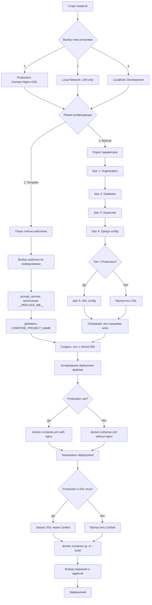

# Аналитический отчет по скрипту установки OK Tools: install.sh

[`deployment/scripts/install.sh`](../scripts/install.sh)

## Краткое описание назначения скрипта

Скрипт выполняет интерактивную установку производственной среды OK Tools с «гибридной» логикой: поддерживает два сценария конфигурирования — через готовый ENV-шаблон и через ручной опрос параметров с генерацией `.env`. Он создает структуру каталога для продакшена, формирует ENV-файл, копирует необходимые docker/deployment файлы (в том числе Nginx и Certbot для продакшн-сервера), и запускает Docker Compose. В режиме продакшн с доменом дополнительно поддерживается заявка SSL-сертификата через Certbot.

## Пошаговый анализ работы скрипта

### 1. Инициализация путей и печать заголовка

- Определение путей к каталогам (строки 7-11):
  - `SCRIPT_DIR` — путь к директории скрипта
  - `PROJECT_DIR` — корень проекта
  - `PRODUCTION_DIR` — целевой каталог продакшена (`../ok_tools_production`)
  - `CONFIGS_DIR` — директория с шаблонами конфигураций (`deployment/configs`)
  
- Печать приветствия и меню типа установки (строки 12-21):
  - **Тип 1**: Production (домен, Nginx, SSL)
  - **Тип 2**: Local Network (LAN, без домена/SSL)
  - **Тип 3**: Localhost (dev на одной машине)

### 2. Выбор типа установки

- Ветвление по `INSTALL_TYPE` (строки 85-99)
- Печать выбранного режима установки

### 3. Проверка существования целевой директории

- Если `PRODUCTION_DIR` существует — запрос на продолжение (строки 64-72)
- Создание структуры поддиректорий (строка 75):
  ```bash
  mkdir -p "$PRODUCTION_DIR"/{data/postgres,data/static,data/media,logs,backups}
  ```

### 4. Выбор режима конфигурации

- Опрос пользователя (строки 78-83):
  - **1** — «Use existing template» (использовать готовый шаблон)
  - **2** — «Manual configuration» (ручная настройка)

### 5. Вспомогательные функции

#### show_templates() (строки 25-40)
Выводит список `.env.template` файлов в `deployment/configs`:
- Нумерует и печатает базовые имена шаблонов
- Возвращает ошибку, если шаблонов нет

#### prompt_secrets() (строки 43-62)
Обрабатывает интерактивное заполнение секретов:
- Копирует выбранный шаблон в `/tmp/oktools_config.tmp`
- Находит строки с маркером `__REPLACE_ME__`
- Интерактивно запрашивает значения у пользователя
- Заменяет маркеры через `sed`:
  - `KEY=__REPLACE_ME__` → `KEY=<value>` (строка 56)
  - `KEY:__REPLACE_ME__` → `KEY:<value>` (строка 57)
- Возвращает путь к временному файлу

### 6. Сценарий 1: Установка на базе шаблона (INSTALL_MODE=1)

**Шаги:**

1. Показ доступных шаблонов (строки 101-106)
2. Выбор шаблона по номеру или имени (строки 108-128)
3. Запрос секретов через `prompt_secrets()` (строки 131-133)
4. Добавление `COMPOSE_PROJECT_NAME=oktools` (строка 135)
5. Копирование конфига в `PRODUCTION_DIR/.env` с правами `600` (строки 137-139)
6. Копирование deployment файлов (строки 143-170):
   - **Для Production (тип 1)**:
     - `docker-compose.production.yml`
     - `nginx.conf.template`
     - `nginx-entrypoint.sh` (с `chmod +x`)
   - **Для LAN/Localhost (типы 2/3)**:
     - `docker-compose.production.no-nginx.yml`
   - **Универсально**:
     - `production.Dockerfile`
     - `entrypoint.production.sh` (с `chmod +x`)
     - Вся папка `deployment/` (объяснение ниже)

### 7. Сценарий 2: Ручная конфигурация (INSTALL_MODE=2)

**Шаг 1: Данные организации (строки 175-184)**
- `ORG_NAME`, `ORG_SHORT_NAME`, `ORG_WEBSITE`
- `ORG_EMAIL`, `ORG_PHONE`, `ORG_ADDRESS`
- `STATE_MEDIA_INSTITUTION`

**Шаг 2: База данных (строки 186-193)**
- Запрос `DB_PASSWORD` или авто-генерация:
  ```bash
  DB_PASSWORD=$(openssl rand -base64 32)
  ```

**Шаг 3: Суперпользователь (строки 195-205)**
- `SUPERUSER_USERNAME` (default: `admin`)
- `SUPERUSER_EMAIL`
- `SUPERUSER_PASSWORD` (или авто-генерация)

**Шаг 4: Django конфигурация (строки 207-227)**
- Генерация `DJANGO_SECRET_KEY`:
  ```bash
  DJANGO_SECRET_KEY=$(openssl rand -base64 50)
  ```
- Определение `ALLOWED_HOSTS` по типу установки:
  - **Production**: ввод хостов вручную
  - **LAN**: использование IP-адреса сервера
  - **Localhost**: `localhost,127.0.1`
- `BACKUP_DIR="/app/backups"` по умолчанию

**Шаг 5: SSL конфигурация (строки 230-248)**
- Только для Production (тип 1)
- Вопрос о включении SSL с Certbot
- Если да: ввод `DOMAIN_NAME` и `SSL_EMAIL`

**Генерация .env файла (строки 250-341)**

Файл создается секциями через последовательные `echo` команды:

1. **Заголовок** (строки 253-256)
2. **Database** (строки 259-264)
3. **Django** (строки 267-272)
4. **Organization** (строки 275-284)
   - Особая обработка `ORG_ADDRESS` с заменой `\n`:
     ```bash
     echo "ORG_ADDRESS=$ORG_ADDRESS" | sed 's/\\n/\n/g' >> "$ENV_FILE"
     ```
5. **Superuser** (строки 287-291)
6. **Application** (строки 294-297)
7. **Gunicorn** (строки 300-306)
8. **Redis** (строки 309-311)
9. **NAS** (строки 314-318)
10. **SSL** (строки 320-328, только для Production)
11. **Logging** (строки 331-333)
12. **Backup** (строки 335-339)

Установка прав `chmod 600` на ENV файл (строка 340)

### 8. Запрос SSL-сертификата

Только для Production с включенным SSL (строки 377-386):
```bash
docker compose run --rm --entrypoint "\
  certbot certonly --webroot -w /var/www/certbot \
    --email $SSL_EMAIL --agree-tos --no-eff-email \
    -d $DOMAIN_NAME" certbot
```

### 9. Запуск контейнеров

- Переход в `PRODUCTION_DIR` (строки 388-397)
- Проверка наличия файлов
- Запуск Docker Compose:
  ```bash
  docker compose --project-directory . up -d --build
  ```

### 10. Завершение и вывод подсказок

Печать информации (строки 399-420):
- Путь к production директории и `.env`
- Советы по мониторингу (`docker compose ps`, `logs -f web`)
- Адрес админ-панели (в зависимости от типа установки)
- Ссылки на скрипты обновления и конфигурирования

## Детальный анализ работы с ENV файлами

### Шаблонный режим (Template-based)

#### Процесс работы:

1. **Список шаблонов**: `show_templates()`
   - Поиск всех `*.env.template` в `deployment/configs`
   - Пример: [`deployment/configs/ok-nrw.env.template`](../configs/ok-nrw.env.template)

2. **Заполнение секретов**: `prompt_secrets()`
   - Копирование шаблона → `/tmp/oktools_config.tmp`
   - Интерактивная замена маркеров:
     - `KEY=__REPLACE_ME__` → `KEY=<value>`
     - `KEY:__REPLACE_ME__` → `KEY:<value>`

3. **Финализация**:
   - Добавление `COMPOSE_PROJECT_NAME=oktools`
   - Копирование в `PRODUCTION_DIR/.env`
   - Установка прав `600` (только владелец читает/пишет)

#### Структура шаблона

Шаблон содержит следующие секции:

- **Database**: `POSTGRES_DB`, `POSTGRES_USER`, `POSTGRES_PASSWORD`, `DATABASE_URL`
- **Django**: `DJANGO_SETTINGS_MODULE`, `DJANGO_SECRET_KEY`, `DEBUG`, `ALLOWED_HOSTS`
- **Organization**: `ORG_NAME`, `ORG_SHORT_NAME`, `ORG_WEBSITE`, `ORG_EMAIL`, `ORG_ADDRESS`, `ORG_PHONE`, `ORG_FAX`, `ORG_DESCRIPTION`, `ORG_OPENING_HOURS`, `STATE_MEDIA_INSTITUTION`
- **Superuser**: `SUPERUSER_USERNAME`, `SUPERUSER_EMAIL`, `SUPERUSER_PASSWORD`
- **Application**: `PYTHONPATH`, `PYTHONUNBUFFERED`
- **Gunicorn**: `GUNICORN_WORKERS`, `GUNICORN_THREADS`, `GUNICORN_TIMEOUT`, `GUNICORN_MAX_REQUESTS`, `GUNICORN_MAX_REQUESTS_JITTER`
- **Redis**: `REDIS_URL`
- **NAS**: `NAS_PLAYOUT_PATH`, `NAS_ARCHIVE_PATH`, `NAS_MOUNT_ENABLED`
- **SSL**: `SSL_ENABLED`, `SSL_CERT_PATH`, `SSL_KEY_PATH`
- **Logging**: `LOG_LEVEL`
- **Backup**: `BACKUP_DIR`

### Ручной режим (Manual)

Генерация `.env` выполняется секциями через `echo`:

#### Database Configuration
```bash
echo "POSTGRES_DB=oktools" >> "$ENV_FILE"
echo "POSTGRES_USER=oktools" >> "$ENV_FILE"
echo "POSTGRES_PASSWORD=$DB_PASSWORD" >> "$ENV_FILE"
echo "DATABASE_URL=postgresql://oktools:$DB_PASSWORD@db:5432/oktools" >> "$ENV_FILE"
```

#### Django Configuration
```bash
echo "DJANGO_SETTINGS_MODULE=ok_tools.settings" >> "$ENV_FILE"
echo "DJANGO_SECRET_KEY=$DJANGO_SECRET_KEY" >> "$ENV_FILE"
echo "DEBUG=False" >> "$ENV_FILE"
echo "ALLOWED_HOSTS=$ALLOWED_HOSTS" >> "$ENV_FILE"
```

#### Organization Configuration
```bash
echo "ORG_NAME=$ORG_NAME" >> "$ENV_FILE"
echo "ORG_SHORT_NAME=$ORG_SHORT_NAME" >> "$ENV_FILE"
# ... другие поля
# Особая обработка адреса с переводами строк:
echo "ORG_ADDRESS=$ORG_ADDRESS" | sed 's/\\n/\n/g' >> "$ENV_FILE"
```

#### Остальные секции
- **Superuser**: логин, email, пароль
- **Application**: Python пути и буферизация
- **Gunicorn**: workers, threads, timeout, max_requests
- **Redis**: URL подключения
- **NAS**: пути к network storage (опционально)
- **SSL**: только для Production — сертификаты и домен
- **Logging**: уровень логирования
- **Backup**: директория для бэкапов
- **Compose**: имя проекта

### Копирование ENV-файлов

**Шаблонный сценарий:**
- Временный конфиг создается в `/tmp/oktools_config.tmp`
- Обогащается `COMPOSE_PROJECT_NAME`
- Копируется в `PRODUCTION_DIR/.env`

**Ручной сценарий:**
- `.env` создается напрямую в `PRODUCTION_DIR/.env`
- Заполняется последовательно секция за секцией

**В обоих случаях:**
- Устанавливаются права `600` (только владелец)
- Обеспечивается безопасность чувствительных данных

## Зачем копируется вся папка deployment/

### Причина копирования (строки 159, 361)

```bash
# Copy entire deployment directory to ensure docker compose can access all necessary files
cp -r "$PROJECT_DIR/deployment" "$PRODUCTION_DIR/deployment"
```

### Технические причины:

1. **Docker Compose зависимости**
   - Файл `docker-compose.yml` использует относительные пути:
     ```yaml
     build:
       context: ../ok_tools
       dockerfile: deployment/production.Dockerfile
     ```
   - Контейнеры ссылаются на файлы внутри `deployment/`:
     ```yaml
     entrypoint: /app/deployment/entrypoint.production.sh
     ```

2. **Монтирование в контейнеры**
   - Контейнер `web` монтирует deployment в read-only режиме:
     ```yaml
     volumes:
       - ./deployment:/app/deployment:ro
     ```
   - Это обеспечивает доступ к entrypoint скриптам внутри контейнера

3. **Необходимые файлы в deployment/**
   - `production.Dockerfile` — для сборки образа
   - `entrypoint.production.sh` — точка входа web-контейнера
   - `nginx-entrypoint.sh` — точка входа nginx-контейнера (для Production)
   - `nginx.conf.template` — шаблон конфигурации Nginx
   - `configs/` — дополнительные конфигурационные файлы

4. **Изоляция production окружения**
   - Production директория становится самодостаточной
   - Все необходимые файлы находятся локально
   - Не требуется доступ к исходному репозиторию при перезапуске

5. **Обновления и поддержка**
   - Скрипт `update.sh` также обновляет `deployment/`:
     ```bash
     cp -r "$PROJECT_DIR/deployment" "$PRODUCTION_DIR/deployment"
     ```
   - Гарантирует актуальность всех deployment файлов

### Альтернативный подход (не используется)

Теоретически можно было бы:
- Копировать только необходимые файлы
- Использовать симлинки

**Но это создало бы проблемы:**
- Зависимость от исходной структуры проекта
- Риск рассинхронизации при обновлениях
- Сложность в управлении зависимостями

## Используемые функции и их назначение

### show_templates()
**Назначение**: Показать доступные конфигурационные шаблоны

**Логика**:
- Ищет `*.env.template` в `deployment/configs`
- Нумерует и выводит список
- Возвращает ошибку, если шаблоны отсутствуют

### prompt_secrets()
**Назначение**: Интерактивное заполнение секретных значений

**Параметры**:
- `$1` — путь к файлу шаблона

**Процесс**:
1. Копирование шаблона во временный файл
2. Поиск строк с `__REPLACE_ME__`
3. Интерактивный запрос значений
4. Замена через `sed` (поддержка `=` и `:` форматов)
5. Возврат пути к заполненному временному файлу

### Команды генерации секретов

**Пароли и ключи**:
```bash
# Database password
DB_PASSWORD=$(openssl rand -base64 32)

# Django secret key
DJANGO_SECRET_KEY=$(openssl rand -base64 50)

# Superuser password
SUPERUSER_PASSWORD=$(openssl rand -base64 32)
```

### SSL сертификаты (Production)

**Запрос сертификата через Certbot**:
```bash
docker compose run --rm --entrypoint "\
  certbot certonly --webroot -w /var/www/certbot \
    --email $SSL_EMAIL --agree-tos --no-eff-email \
    -d $DOMAIN_NAME" certbot
```

**Nginx entrypoint**:
- Использует `envsubst` для подстановки `${DOMAIN_NAME}`
- Ожидает появления сертификатов
- Запускает Nginx в foreground режиме

## Зависимости и требования

### Системные требования

**Docker и Docker Compose**:
- Запуск multi-container стека
- Сборка образов
- Управление lifecycle контейнеров

**Сервисы в стеке**:
- `db` — PostgreSQL 15
- `redis` — Redis 7 Alpine
- `web` — Django приложение с Gunicorn
- `nginx` — Reverse proxy (только Production)
- `certbot` — SSL сертификаты (только Production)
- `celery_worker` — Фоновые задачи
- `celery_beat` — Планировщик задач

### Утилиты командной строки

- **OpenSSL**: генерация паролей и секретных ключей
- **sed**: замена текста в файлах
- **cp, chmod, mkdir**: файловые операции
- **bash**: интерпретатор скриптов

### Структура директорий

**Создаваемые поддиректории**:
```
ok_tools_production/
├── data/
│   ├── postgres/    # База данных PostgreSQL
│   ├── static/      # Статические файлы Django
│   └── media/       # Медиа файлы пользователей
├── logs/            # Логи приложения
├── backups/         # Бэкапы базы данных
├── certbot/         # SSL сертификаты (Production)
└── deployment/      # Копия deployment файлов
```

### Docker файлы

**production.Dockerfile**:
- Системные зависимости: gcc, postgresql-client, ffmpeg, mediainfo
- Python зависимости из `requirements.txt`
- Gunicorn для production сервера
- Healthcheck на `/health` endpoint

**entrypoint.production.sh**:
- Миграции базы данных
- Сбор статических файлов (`collectstatic`)
- Создание суперпользователя
- Настройка организаций
- Запуск Gunicorn с параметрами из ENV

### Compose файлы

**docker-compose.production.yml** (с Nginx):
- Полный стек с reverse proxy
- SSL сертификаты через Certbot
- Раздача статики через Nginx

**docker-compose.production.no-nginx.yml** (без Nginx):
- Упрощенный стек для LAN/Localhost
- Прямой доступ к Django на порту 8000

## Используемые внешние файлы

### Docker Compose конфигурации

**deployment/docker-compose.production.yml**:
- Services: db, redis, web, nginx, certbot, celery_worker, celery_beat
- Volumes для persistent storage
- Networks для изоляции
- Health checks для зависимостей

**deployment/docker-compose.production.no-nginx.yml**:
- Такой же стек без Nginx и Certbot
- Упрощенная конфигурация для разработки/LAN

### Nginx конфигурация

**deployment/nginx.conf.template**:
- HTTP → HTTPS редирект
- SSL конфигурация с современными cipher suites
- Security headers (X-Frame-Options, CSP, HSTS)
- Раздача статики с кэшированием
- Проксирование к Django upstream
- Rate limiting для API и login endpoints
- Специальная обработка видео-стриминга

**deployment/nginx-entrypoint.sh**:
- Подстановка `${DOMAIN_NAME}` через `envsubst`
- Ожидание готовности SSL сертификатов
- Запуск Nginx в daemon-off режиме

### Application entrypoint

**deployment/entrypoint.production.sh**:
```bash
# Миграции
python manage.py migrate --noinput

# Статика
python manage.py collectstatic --noinput

# Суперпользователь
if [ -n "$SUPERUSER_USERNAME" ]; then
    python manage.py shell << END
    # Создание superuser если не существует
    END
fi

# Организации
python manage.py setup_organizations

# Gunicorn
exec gunicorn \
    --bind 0.0.0.0:8000 \
    --workers ${GUNICORN_WORKERS:-4} \
    # ... другие параметры
    ok_tools.wsgi:application
```

### Шаблоны и конфигурации

**deployment/configs/ok-nrw.env.template**:
- Готовый шаблон для NRW организации
- Все необходимые переменные
- Маркеры `__REPLACE_ME__` для секретов

**deployment/configs/ok-nrw-production.cfg**:
- Пример полной production конфигурации
- INI формат с секциями
- Дополнительные настройки (PeerTube, media paths, celery beat)

### Утилиты Post-install

**deployment/scripts/update.sh**:
- Обновление кода из git
- Ремонт поврежденных `.env` файлов
- Rebuild Docker образов
- Перезапуск контейнеров
- Миграции и collectstatic

**deployment/scripts/configure.sh**:
- Создание дополнительных superuser
- Setup organizations
- Запуск management команд
- Бэкап базы данных
- Просмотр логов

## Примеры из кода

### Создание структуры каталогов
```bash
mkdir -p "$PRODUCTION_DIR"/{data/postgres,data/static,data/media,logs,backups}
```

### Замена секретов в шаблоне
```bash
while IFS= read -r line; do
    if [[ $line =~ ^[^#].*=.*__REPLACE_ME__.*$ ]]; then
        key=$(echo "$line" | cut -d'=' -f1)
        echo -n "Enter value for $key: " >&2
        read -r value
        sed -i.bak "s|$key=__REPLACE_ME__|$key=$value|g" "$temp_config"
        sed -i.bak "s|$key:__REPLACE_ME__|$key:$value|g" "$temp_config"
    fi
done < "$template"
```

### Генерация секции Database в .env
```bash
echo "# Database Configuration" >> "$ENV_FILE"
echo "POSTGRES_DB=oktools" >> "$ENV_FILE"
echo "POSTGRES_USER=oktools" >> "$ENV_FILE"
echo "POSTGRES_PASSWORD=$DB_PASSWORD" >> "$ENV_FILE"
echo "DATABASE_URL=postgresql://oktools:$DB_PASSWORD@db:5432/oktools" >> "$ENV_FILE"
```

### Обработка адреса с переводами строк
```bash
# Пользователь вводит адрес с \n
read -p "Organization address (use \\n for line breaks): " ORG_ADDRESS

# Сохранение в .env с реальными переводами строк
echo "ORG_ADDRESS=$ORG_ADDRESS" | sed 's/\\n/\n/g' >> "$ENV_FILE"
```

### Запрос SSL сертификата
```bash
if [ "$INSTALL_TYPE" = "1" ] && [ "$SSL_ENABLED" = true ]; then
    docker compose run --rm --entrypoint "\
      certbot certonly --webroot -w /var/www/certbot \
        --email $SSL_EMAIL --agree-tos --no-eff-email \
        -d $DOMAIN_NAME" certbot
fi
```

### Условное копирование compose файлов
```bash
if [ "$INSTALL_TYPE" = "1" ]; then
    # Production: с nginx
    cp "$PROJECT_DIR/deployment/docker-compose.production.yml" "$PRODUCTION_DIR/docker-compose.yml"
    cp "$PROJECT_DIR/deployment/nginx.conf.template" "$PRODUCTION_DIR/nginx.conf.template"
    cp "$PROJECT_DIR/deployment/nginx-entrypoint.sh" "$PRODUCTION_DIR/nginx-entrypoint.sh"
    chmod +x "$PRODUCTION_DIR/nginx-entrypoint.sh"
else
    # LAN/Localhost: без nginx
    cp "$PROJECT_DIR/deployment/docker-compose.production.no-nginx.yml" "$PRODUCTION_DIR/docker-compose.yml"
fi
```

## Диаграмма потока выполнения



## Итоговые переменные окружения

### Обязательные для всех типов установки

**Database**:
- `POSTGRES_DB=oktools`
- `POSTGRES_USER=oktools`
- `POSTGRES_PASSWORD` (сгенерированный или введенный)
- `DATABASE_URL=postgresql://oktools:<password>@db:5432/oktools`

**Django**:
- `DJANGO_SETTINGS_MODULE=ok_tools.settings`
- `DJANGO_SECRET_KEY` (сгенерированный)
- `DEBUG=False`
- `ALLOWED_HOSTS` (зависит от типа установки)

**Organization**:
- `ORG_NAME`, `ORG_SHORT_NAME`, `ORG_WEBSITE`
- `ORG_EMAIL`, `ORG_PHONE`, `ORG_ADDRESS`
- `STATE_MEDIA_INSTITUTION`

**Superuser**:
- `SUPERUSER_USERNAME` (default: admin)
- `SUPERUSER_EMAIL`
- `SUPERUSER_PASSWORD` (сгенерированный или введенный)

**Application**:
- `PYTHONPATH=/app`
- `PYTHONUNBUFFERED=1`

**Gunicorn**:
- `GUNICORN_WORKERS=4`
- `GUNICORN_THREADS=2`
- `GUNICORN_TIMEOUT=120`
- `GUNICORN_MAX_REQUESTS=1000`
- `GUNICORN_MAX_REQUESTS_JITTER=100`

**Redis**:
- `REDIS_URL=redis://redis:6379/0`

**NAS** (опционально):
- `NAS_PLAYOUT_PATH=/mnt/nas/playout`
- `NAS_ARCHIVE_PATH=/mnt/nas/archive`
- `NAS_MOUNT_ENABLED=false`

**Logging**:
- `LOG_LEVEL=info`

**Backup**:
- `BACKUP_DIR=/app/backups`

**Compose**:
- `COMPOSE_PROJECT_NAME=oktools`

### Дополнительно для Production (тип 1)

**SSL/HTTPS**:
- `SSL_ENABLED` (true/false)
- `SSL_CERT_PATH=/etc/nginx/ssl/cert.pem`
- `SSL_KEY_PATH=/etc/nginx/ssl/key.pem`
- `DOMAIN_NAME` (доменное имя сервера)

## Заключение

Скрипт [`deployment/scripts/install.sh`](../scripts/install.sh) представляет собой комплексное решение для развертывания OK Tools в production окружении. Его ключевые особенности:

### Сильные стороны

1. **Гибкость**: поддержка трех типов установки (Production/LAN/Localhost)
2. **Безопасность**: автоматическая генерация секретов, права 600 на .env
3. **Удобство**: два режима конфигурации (шаблон/ручной)
4. **Полнота**: включает SSL сертификаты, Nginx, мониторинг
5. **Изоляция**: самодостаточная production директория

### Работа с ENV файлами

**Создание**:
- Из шаблона с интерактивным заполнением секретов
- Ручная генерация секция за секцией

**Редактирование**:
- Замена маркеров `__REPLACE_ME__` через sed
- Добавление дополнительных параметров (COMPOSE_PROJECT_NAME)

**Копирование**:
- Из временного файла в production директорию
- Установка безопасных прав доступа

### Копирование deployment/

Папка `deployment/` копируется целиком для обеспечения:
- Доступности entrypoint скриптов в контейнерах
- Корректной работы Docker Compose
- Изоляции production окружения
- Упрощения обновлений

### Дополнительные инструменты

- **update.sh**: обновление приложения с ремонтом .env
- **configure.sh**: пост-конфигурация и управление

Скрипт обеспечивает надежное и безопасное развертывание OK Tools для любого типа установки, от локальной разработки до production сервера с SSL.