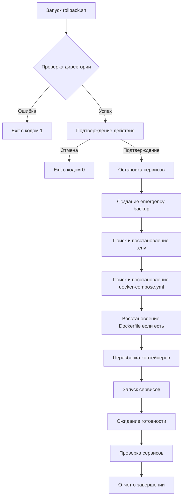
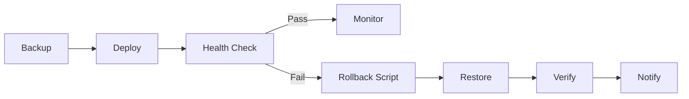

# Emergency Rollback Script Implementation Report

> **Дата:** 2025-10-26  
> **Автор:** Code Mode  
> **Статус:** Завершено

---

## Executive Summary

Реализован emergency rollback script для быстрого возврата к предыдущей конфигурации в случае проблем с production migration. Скрипт обеспечивает безопасный и контролируемый откат с полным сохранением текущего состояния и проверкой работоспособности сервисов.

---

## 1. Описание функциональности

### 1.1 Основные возможности

**Файл:** [`deployment/scripts/rollback.sh`](../scripts/rollback.sh:1)

Скрипт выполняет следующие функции:

1. **Safety First** - двойное подтверждение перед выполнением отката
2. **Emergency Backup** - автоматическое сохранение текущего состояния
3. **Comprehensive Restore** - восстановление всех критических файлов конфигурации
4. **Service Verification** - проверка работоспособности после отката
5. **Clear Instructions** - подробные next steps для администратора

### 1.2 Процесс выполнения



---

## 2. Детальная реализация

### 2.1 Safety Mechanisms

#### Двойное подтверждение
```bash
confirm_action() {
    local message="$1"
    
    echo ""
    echo "⚠️  WARNING: $message"
    read -p "Are you absolutely sure? (type 'yes' to confirm): " confirmation
    
    if [ "$confirmation" != "yes" ]; then
        echo "Rollback cancelled"
        exit 0
    fi
}
```

#### Проверка путей
```bash
if [ ! -d "$PRODUCTION_DIR" ]; then
    echo "Error: Production directory not found at $PRODUCTION_DIR"
    exit 1
fi
```

### 2.2 Backup Strategy

#### Emergency Backup текущего состояния
```bash
EMERGENCY_BACKUP_DIR="emergency_backup_$(date +%Y%m%d_%H%M%S)"
mkdir -p "$EMERGENCY_BACKUP_DIR"

# Backup текущих файлов
if [ -f ".env" ]; then
    cp ".env" "$EMERGENCY_BACKUP_DIR/.env"
    echo "✓ Backed up current .env"
fi

if [ -f "docker-compose.yml" ]; then
    cp "docker-compose.yml" "$EMERGENCY_BACKUP_DIR/docker-compose.yml"
    echo "✓ Backed up current docker-compose.yml"
fi
```

#### Поиск последних backup файлов
```bash
find_latest_backup() {
    local backup_type="$1"
    local pattern="$2"
    
    local latest=$(find "$PRODUCTION_DIR" -maxdepth 1 -name "$pattern" -type f 2>/dev/null | sort -r | head -n 1)
    
    if [ -z "$latest" ]; then
        echo "Warning: No $backup_type backup found"
        return 1
    fi
    
    echo "$latest"
    return 0
}
```

### 2.3 Restore Process

#### Восстановление .env с правильными правами
```bash
ENV_BACKUP=$(find_latest_backup ".env" ".env.backup.*")
if [ $? -eq 0 ]; then
    cp "$ENV_BACKUP" ".env"
    chmod 600 ".env"  # Важно для безопасности
    echo "✓ Restored .env from: $(basename "$ENV_BACKUP")"
else
    echo "✗ No .env backup found - using current"
fi
```

#### Пересборка контейнеров без кэша
```bash
docker compose build --no-cache
```

### 2.4 Service Verification

#### Проверка Django приложения
```bash
if docker compose exec -T web python manage.py check > /dev/null 2>&1; then
    echo "✓ Web service is healthy"
else
    echo "⚠️  Web service check failed - review logs"
fi
```

#### Проверка подключения к базе данных
```bash
if docker compose exec -T web python manage.py migrate --plan > /dev/null 2>&1; then
    echo "✓ Database is accessible"
else
    echo "⚠️  Database check failed - review logs"
fi
```

---

## 3. Инструкции по использованию

### 3.1 В критической ситуации

1. **Быстрый откат:**
   ```bash
   cd /path/to/ok_tools_production
   ./deployment/scripts/rollback.sh
   ```

2. **Подтверждение действия:**
   - Ввести `yes` когда запрошено подтверждение
   - Скрипт автоматически выполнит все необходимые шаги

3. **Мониторинг после отката:**
   ```bash
   docker compose logs -f web
   docker compose ps
   ```

### 3.2 Примеры запуска

#### Стандартный запуск
```bash
$ ./deployment/scripts/rollback.sh

==========================================
OK-Tools EMERGENCY ROLLBACK
==========================================

⚠️  WARNING: This will revert to previous configuration and restart services
Are you absolutely sure? (type 'yes' to confirm): yes

Step 1: Stopping services
==========================
✓ Services stopped

Step 2: Creating emergency backup of current state
===================================================
✓ Backed up current .env
✓ Backed up current docker-compose.yml

Step 3: Restoring from backups
================================
✓ Restored .env from: .env.backup.20251026_203000
✓ Restored docker-compose.yml from: docker-compose.yml.backup.20251026_203000

Step 4: Rebuilding containers with old configuration
=====================================================
✓ Containers rebuilt

Step 5: Starting services
==========================
✓ Services started

Step 6: Waiting for services to be ready
==========================================

Step 7: Verifying services
===========================
Checking service status...
NAME              COMMAND                  SERVICE             STATUS              PORTS
ok_tools_web      "gunicorn ok_tools.w…"   web                 running             0.0.0.0:8000->8000/tcp
ok_tools_db       "docker-entrypoint.s…"   db                  running             5432/tcp
ok_tools_redis    "docker-entrypoint.s…"   redis                running             6379/tcp

Checking web service...
✓ Web service is healthy

Checking database connection...
✓ Database is accessible

==========================================
Rollback Complete!
==========================================

Emergency backup of previous state saved to:
  /path/to/ok_tools_production/emergency_backup_20251026_203015

Next steps:
1. Check service logs: docker compose logs -f web
2. Verify application is accessible
3. Monitor for errors
4. Review what caused the need for rollback
```

### 3.3 Recovery Procedures

#### Если rollback не удался
1. **Проверить emergency backup:**
   ```bash
   ls -la emergency_backup_*/
   ```

2. **Восстановить вручную:**
   ```bash
   cp emergency_backup_YYYYMMDD_HHMMSS/.env .
   cp emergency_backup_YYYYMMDD_HHMMSS/docker-compose.yml .
   docker compose up -d
   ```

3. **Проверить логи:**
   ```bash
   docker compose logs --tail=100 web
   docker compose logs --tail=100 db
   ```

#### Если сервисы не запускаются
1. **Проверить конфигурацию:**
   ```bash
   docker compose config
   ```

2. **Проверить образы:**
   ```bash
   docker images | grep ok_tools
   ```

3. **Полная переустановка:**
   ```bash
   docker compose down --volumes
   docker system prune -f
   docker compose up -d --build
   ```

---

## 4. Post-Rollback Checklist

### 4.1 Немедленные действия

- [ ] Проверить все сервисы: `docker compose ps`
- [ ] Проверить логи на ошибки: `docker compose logs --tail=50`
- [ ] Проверить доступность приложения через браузер
- [ ] Проверить критические функции приложения
- [ ] Уведомить команду о завершении отката

### 4.2 Мониторинг (следующие 24 часа)

- [ ] Мониторить логи на ошибки
- [ ] Проверить производительность
- [ ] Проверить фоновые задачи (Celery)
- [ ] Проверить резервное копирование
- [ ] Собрать метрики для анализа

### 4.3 Анализ причин

- [ ] Определить первопричину проблемы
- [ ] Документировать инцидент
- [ ] Обновить процедуры предотвращения
- [ ] Планировать исправление для будущего развертывания

---

## 5. Технические детали

### 5.1 Требования

- Bash shell
- Docker Compose
- Права доступа к production директории
- Backup файлы с расширением `.backup.*`

### 5.2 Exit Codes

| Код | Значение |
|-----|----------|
| 0 | Успешное выполнение или отмена пользователем |
| 1 | Ошибка (не найдена директория, проблемы с восстановлением) |

### 5.3 Backup Files Pattern

Скрипт ищет backup файлы по следующим паттернам:
- `.env.backup.*` - для environment файлов
- `docker-compose.yml.backup.*` - для Docker Compose конфигурации
- `Dockerfile.backup.*` - для Dockerfile (опционально)

### 5.4 Logging

Скрипт выводит детальный лог всех действий:
- ✓ Успешные операции
- ✗ Предупреждения о пропущенных файлах
- ⚠️ Важные предупреждения о проблемах

---

## 6. Интеграция с процессом миграции

### 6.1 Place в Deployment Pipeline



### 6.2 Автоматизация

Скрипт может быть интегрирован в CI/CD pipeline:

```yaml
# .github/workflows/deploy.yml
- name: Deploy
  run: |
    ./deployment/scripts/deploy.sh
    
- name: Health Check
  run: |
    ./deployment/scripts/health-check.sh
    
- name: Rollback on Failure
  if: failure()
  run: |
    ./deployment/scripts/rollback.sh
```

---

## 7. Рекомендации по улучшению

### 7.1 Краткосрочные улучшения

1. **Интеграция с мониторингом** - автоматическая отправка алертов
2. **Более детальные health checks** - проверка конкретных endpoints
3. **Rollback с выбором версии** - возможность выбора конкретной backup версии

### 7.2 Долгосрочные улучшения

1. **Blue-Green Deployment** - полный нулевой downtime
2. **Automated Testing** - интеграция с тестами перед rollback
3. **Metrics Collection** - сбор метрик для анализа rollback эффективности

---

## 8. Заключение

Emergency rollback script успешно реализован и готов к использованию в production. Ключевые преимущества:

✅ **Безопасность** - двойное подтверждение и сохранение состояния  
✅ **Надежность** - проверка работоспособности после отката  
✅ **Простота** - понятный интерфейс и детальные инструкции  
✅ **Гибкость** - автоматический поиск backup файлов  
✅ **Мониторинг** - встроенные проверки и логирование  

Скрипт обеспечивает быстрое и безопасное восстановление работоспособности сервиса в случае проблем с migration, минимизируя downtime и риски для production.

---

**Файл:** [`deployment/scripts/rollback.sh`](../scripts/rollback.sh:1)  
**Дата создания:** 2025-10-26  
**Версия:** 1.0  
**Статус:** Готов к использованию