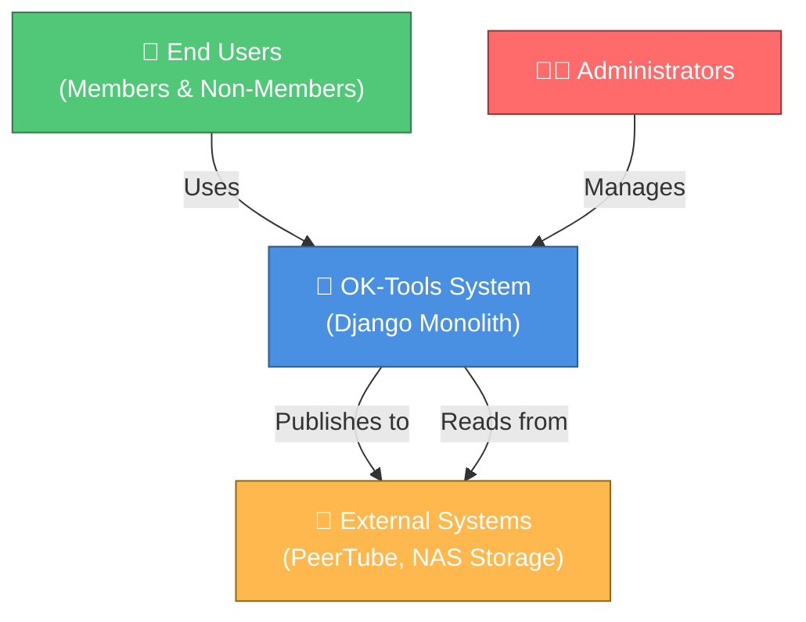
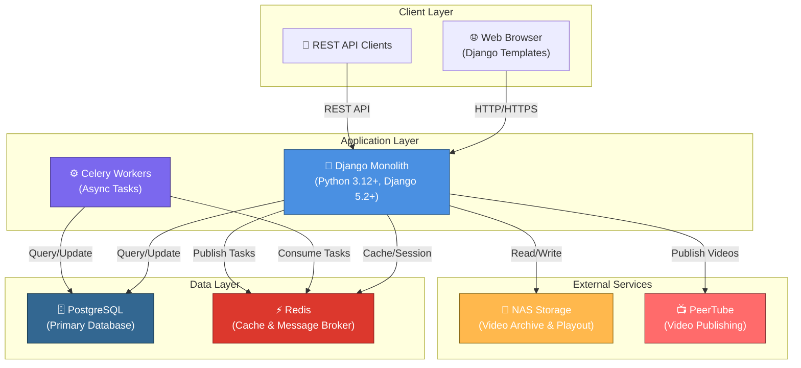

# OK-Tools Architecture Overview

## Table of Contents

1. [Project Overview](#project-overview)
2. [System Architecture (C4 Model)](#system-architecture-c4-model)
3. [Django Application Structure](#django-application-structure)
4. [Architectural Patterns](#architectural-patterns)
5. [Technology Stack](#technology-stack)
6. [Development Setup Guide](#development-setup-guide)

---

## Project Overview

### Purpose

**OK-Tools** is a comprehensive Django-based management system for the "Offener Kanal Merseburg-Querfurt e.V." (OK MRSQ), a community media organization. The system manages multiple interconnected domains:

- **Equipment Rental Management**: Track and manage equipment rentals with availability checking and reservation system
- **Inventory Management**: Maintain detailed inventory records with hierarchical location tracking, inspections, and audit logs
- **License Management**: Handle media licenses and permissions
- **User Registration & Profiles**: Manage user accounts with membership status and permissions
- **Project Planning**: Track media projects and productions
- **Contribution Tracking**: Record and manage user contributions
- **Media File Management**: Organize and manage video/audio files with archive and playout integration, automatic copying during planning, and archive protection
- **Dashboard & Analytics**: Provide real-time insights into system operations

### Key Characteristics

- **Multi-tenant Ready**: Supports multiple organizations with different access levels
- **Event-Driven**: Uses asynchronous events for inter-module communication
- **Service-Oriented**: Implements service layer pattern for business logic separation
- **API-First**: RESTful API for all major operations
- **Scalable**: Uses Celery for asynchronous task processing
- **Monitored**: Integrated Prometheus metrics and JSON logging

### Recent Updates

- **Signing a quick issue, youth protection windows, reminders and delegation**: Quick issue opens the signature dialog as soon as the rental exists, with a third "sign on paper" option that offers the issue slips directly — one per owner when a rental mixes them — while signing stays optional. Quick mode refuses a pickup in the past or outside the opening hours, correcting the period instead of letting the backend reject it, and the scan tone became a setting that is off by default. Reel notifications now cover only premieres and repeats that already have a Mediathek URL, since a repeat without one gives the reel nothing to link to. `YouthProtectionWindow` configures per age rating when material may be aired (seeded 20:00/22:00/23:00 to 06:00); planning refuses a day that puts a rated item outside its window, names the allowed time, and marks the row while it can still be moved, handling windows and items that cross midnight. Staff can write their own recurring reminders for obligations the data cannot show, delivered through the new subscribable "Reminders" channel, and hand any action item to a colleague — responsibility moves to one person, the sender keeps a "Delegated" view to see who holds it and take it back, and a delegated item arrives even for someone subscribed to nothing.
- **Scanner-ready rental workflows and orphaned task recovery**: The return page sent the human-readable rental code instead of the numeric primary key, so every barcode scan there failed; scans now work, report errors as readable text, and keep focus in the field. Quick mode replaces the full-account `<select>` with the same type-ahead user search the guided step uses, shows each scanned item's real availability status (In stock / Booked / Reserved / Issued with counts), and allows in-place quantity changes. The German return-receipt email no longer falls back to English. A new `ok_tools.celery_health` sweep asks the live workers which task ids they hold and closes the rest as FAILURE — a worker restarted mid-task previously left `TaskResult` in PROGRESS forever — running from beat every 15 minutes or via `manage.py cleanup_stale_tasks`; it skips itself entirely when no worker answers, so a broker hiccup never fails running tasks. The Celery admin and the export result page now say the task was interrupted instead of showing it as still running, and Austausch export errors name the date range, the numbers rejected by the exchange-flag filter, and the numbers already exported.
- **Automatic Nextcloud downloads and screen board photos**: Files uploaded to Nextcloud are fetched into local storage automatically, exactly once, using the same path and naming as the manual Download button; a config switch disables the automation, a catch-up task covers uploads missed while the download worker was down, and moving or deleting the local copy never re-triggers a download. Licenses marked as screen board (Bildschirmtafel) accept photos (jpg, jpeg, png, webp) through the same upload flow as videos, and the upload endpoint now validates the file type against what the license accepts.
- **Resilient room booking and Austausch recovery**: Room calendars distinguish past slots, prevent selecting them, and link occupied blocks directly to rental details. Period edits validate working hours plus room and inventory conflicts before synchronizing linked room reservations. Austausch imports fall back to synchronized JSON metadata during remote API outages, failed entries expose retry actions, and a later successful attempt resolves the old notification. Missing-cover actions are now limited to premieres without an existing contribution.
- **Sortable rental overview**: Every status view in the rental dashboard can order rows by rental ID, project/user, scheduled time, derived status, or the combined inventory and room count. Header clicks toggle direction while status tabs, search, user/content filters and pagination retain the active ordering through validated query parameters.
- **Interactive admin notification center**: The `notifications` app provides a responsive React work surface matching the rental process UI. It is a human-attention queue rather than a system activity log: a row exists only when staff must decide, perform manual work, be present for another person, or recover automation after its grace period/retries. Rental confirmation, pick-up, return and room-opening obligations follow their domain status; the license → Nextcloud → video → committed plan → Cover/Reel/Live chain exposes only its current blocker; ready reels become posting work on the air date. Successful jobs and ordinary video indexing stay silent, and unlinked-video checks inspect only storage locations explicitly selected in notification settings. Stored actions and technical incidents resolve from current model state for every subscriber, and the Problems card excludes recovered failures. Rich rows expose translated details and object-specific actions, while five overview cards filter today's expectations, new events, open actions, postponed items or active problems. Links open the exact rental, exchange, license, media or planning context. Delivery remains page rendering only: no polling or websockets. Three gate levels stay separate — module flag, per-channel switch and personal subscription — and visibility mirrors `ModelAdmin.has_view_permission`. The JSX bundle is part of the production `build:js` pipeline and is collected with the other static assets during deployment.
- **Photo previews across rental admin, and view-served room photos**: Inventory item photos in the admin open in an in-page lightbox and load a downscaled preview (≈1600 px) rather than the full original; room photos are streamed through a staff-only view (with a cached `?size=thumb` variant) so they render even when nginx runs on a separate VM from the app's media folder. Room and inventory thumbnails now appear across the room calendar (day/week/month) and inventory calendar day view, and every such thumbnail zooms into a full-screen lightbox — matching the item photos on the rental process wizard, where room photos are now zoomable too. When an item or room has several photos, the lightbox is a carousel: arrows, a counter, and Left/Right keys page through them, using one shared lightbox script across the rental frontend and the inventory/room admin. The room calendar day page also gained its localization bundle so its timeline renders in German. The rental dashboard gained working filters: a room/inventory content filter and a user-category filter (users, members, employees, rental-only) that mirrors the rental configuration.
- **Cover / thumbnail generation for videos**: The `media_files.covers` package builds 16:9 cover images (`{number}_cover.jpg`) from a video frame plus license metadata. Selection is driven by editor-configurable admin rules — **Cover-Vorlagenregeln** (`CoverTemplate`) choose a template (Base / Journal / Trailer) by series, category, or channel default; **Cover-Grafiken** (`CoverOverlay`) are uploadable PNG/SVG overlays grouped into pools with text/logo areas; **Cover-Grafikregeln** (`CoverOverlayRule`) map a title/category pattern to a pool or explicit graphics in random or all-variants mode (graphic rules win over template rules). Licenses expose admin actions to generate/regenerate a cover or pick a candidate variant, gated behind `cover_enabled`. When exporting to the exchange server, the export reuses the already-created canonical cover (`{number}_cover.jpg` in the cover output dir — the same one shown as "Cover present" on the export step-2 page) and only auto-generates one into the hand-off directory when none exists; licenses that had no cover are listed as auto-generated on the export result page. Bulk `generate_covers` and `pick_cover` management commands are also available.
- **Inventory item photos and rental frontend gallery**: Inventory items can display photos read from a configurable mounted folder (organized per inventory number), indexed by a periodic scan with cached thumbnails and an SVG placeholder. When enabled in the Rental configuration, item photos appear on the rental process wizard and the user dashboard with a click-to-enlarge lightbox, and rooms support admin-uploaded photos shown on the rental process page.
- **Mediathek URL automation and Reel reminders**: Added daily periodic tasks that queue Mediathek URL refreshes from planning and contribution broadcast data, and made Reel reminder emails retry missing Mediathek URLs for up to one hour before sending with an explicit warning.
- **Reel Studio media selection and preview registration**: Reel Studio can search Media Files by number, supports the `sachlich` hook type, ignores generated reels when prefilling a license source video, and records finished reels as preview clips so they are not treated as full video versions.
- **Freistellung print form with staff signature overlay**: Licenses track `confirmed_at`/`confirmed_by`, the LicensesConfig admin exposes Freistellung text, city, sendezeit, and signature-user settings, and the license PDF overlays the confirming staff member's signature on page 2 when the feature is enabled. Staff users can draw or QR-sign a reusable signature on their user admin page.
- **Django 6 upgrade and dependency refresh**: Upgraded Django from 5.2.7 to 6.0.6, refreshed django-stubs, djangorestframework, django-filter, django-celery-beat, django-celery-results, django-bootstrap-datepicker-plus, asgiref, and many patch/minor Python packages. Docker images rebuilt and migrations verified.
- **Rental return reminders and booking tools**: Rental administrators can configure automatic return reminder emails for issued rentals; each rental records when the automatic reminder was sent so retries only happen after delivery failure. Administrators can also manage equipment sets from the rental UI and use expanded room calendar views for week and month scheduling.
- **Playout metadata import from planning**: The planning "Plan!" action can now POST allowlisted media metadata by filename to an external playout import endpoint configured in the Planning Configuration admin UI, with an optional periodic check for playout files missing metadata.
- **Playout schedule import from planning**: The planning "Plan!" action also sends the day's broadcast schedule (day, start times, item kinds, filenames, youth protection) to a configurable external playout schedule endpoint, supporting video, placeholder (Freistellung), and live item kinds.
- **Anchor programme preview render from planning**: Planned days can be sent to a configurable external anchor renderer; OK Tools now waits for playout copy readiness, queues preview rendering asynchronously, exposes task status polling, and formats the output filename from configuration.
- **Playout API endpoints**: Planning exposes DRF-token-protected endpoints for external playout systems to pull media metadata and schedules and to submit air reports/webhook events.
- **Rental user selection optimization**: Prioritized initial user fetch for rental process, unified user search endpoints with shared serialization, added tests
- **Austausch visibility rules**: Feed items now respect `allowExchange`/`allowExchangeOtherStates`, compare `bundesland_code` against the local organization config, and support configurable same-state channel exceptions from the exchange admin settings
- **Bundesland metadata compatibility**: Organization configuration now stores the export Bundesland, auto-generates the Bundesland code, and guarantees both fields in license metadata/API payloads
- **Nested metadata normalization**: Austausch imports and admin JSON imports now normalize both flat legacy payloads and nested canonical `organization`/`license` structures, including string boolean handling
- **Rental working hours and pick lists**: Added DB-backed weekday opening hours, public/admin validation, smarter room-booking time selection, and printable pick lists with checklist fields on rental items
- **Program schedule metadata**: Extended the contributions program schedule API and admin example output with `mediathek_url` for published licenses
- **Dashboard and planning UX**: Improved dashboard chart translations/placeholders and kept filtered planning calendar cells hidden from keyboard navigation without breaking table layout
- **Nextcloud chunked upload v2**: Fixed large file export (9GB+) to Nextcloud using proper chunked upload v2 API with MKCOL/PUT/MOVE sequence
- **Mediathek link maintenance**: Added backfill tooling for legacy licenses plus admin rescan workflow improvements and exchange export UX refinements
- **Licenses notifications**: Added a dedicated "mediathek published" email that is sent once when a license receives its first Mediathek URL, including a direct watch link
- **Admin-safe Mediathek refresh**: Manual admin refresh/rescan paths now skip user email delivery to avoid unintended notification bursts
- **Planning module refactor**: Introduced dedicated planning services, reusable templates, and schedule change tracking with expanded tests
- **Planning calendar UI**: Reworked calendar week admin UX (template, CSS, JavaScript) for better readability and interactions
- **Austausch export to server**: Upload video, PDF, JSON (and optional thumbnails) to Nextcloud WebDAV; step-by-step UI and Celery task
- **Austausch API channel mapping**: Per-channel remote OK-Tools API credentials and deterministic license mapping by source channel + contribution ID
- **Metadata API compatibility**: Kept `name` in license metadata API while extending payload fields and import mapping for subtitle, profile, tags, permissions, and youth-protection flags
- **License signature v2 + QR flow**: Added SVG/biometric signature payloads, QR phone signing sessions, and create/update UX with method selection and synchronized signature rendering
- **Rental emails**: HTML templates with booking details and user-facing links
- **User rentals**: New user request detail page and improved request visibility
- **Module configs**: Module-specific configuration models with DB-backed settings and env fallbacks
- **Tools module**: Content-creation utilities (slideshow/video render/audio jobs) with Celery support

---

## System Architecture (C4 Model)

### Level 1: System Context Diagram



**Description**: The system serves as a central hub for managing equipment rentals, inventory, licenses, and media files. It integrates with external systems like PeerTube for video publishing and NAS storage for media file management.

### Level 2: Container Diagram



**Description**: 
- **Web Browser**: Serves Django templates for user interface
- **REST API**: Provides programmatic access to system resources
- **Django Monolith**: Core application handling business logic, routing, and orchestration
- **Celery Workers**: Process asynchronous tasks (imports, exports, notifications)
- **PostgreSQL**: Primary relational database for all persistent data
- **Redis**: In-memory data store for caching, sessions, and Celery message broker
- **NAS Storage**: Network-attached storage for video files
- **PeerTube**: External video publishing platform

---

## Django Application Structure

### Core Applications

#### `ok_tools` (Project Root)
- **Purpose**: Main Django project configuration and global utilities
- **Key Components**:
  - `settings.py`: Configuration management (database, cache, Celery, logging)
  - `urls.py`: URL routing configuration
  - `celery.py`: Celery application setup
  - `context_processors.py`: Global template context
  - `admin.py`: Custom admin configurations
  - `views.py`: Global views (home, dashboard)

#### `registration`
- **Purpose**: User authentication, profiles, and membership management
- **Key Models**:
  - `OKUser`: Custom user model with email-based authentication
  - `Profile`: Extended user profile with membership status
  - `Notification`: User notifications
- **Key Features**:
  - Email-based authentication
  - User registration and password reset
  - Membership status tracking
  - User profile management

#### `inventory`
- **Purpose**: Equipment inventory management with hierarchical locations
- **Key Models**:
  - `InventoryItem`: Core inventory item with quantity tracking
  - `Location`: Hierarchical location tree (Building → Floor → Room)
  - `Category`: Item categorization
  - `Manufacturer`: Equipment manufacturer tracking
  - `Organization`: Equipment owner organization
  - `Inspection`: Electrical safety inspection records
  - `InventoryImport`: Bulk import tracking with Celery integration
  - `AuditLog`: Change tracking for audit purposes
- **Key Features**:
  - Hierarchical location management
  - Availability tracking (reserved, rented quantities)
  - Bulk import/export with error handling
  - Inspection management
  - Audit logging for compliance
  - Service layer for business logic (`InventoryService`)

#### `rental`
- **Purpose**: Equipment rental request management and room booking
- **Key Models**:
  - `RentalRequest`: Main rental request with status tracking
  - `RentalItem`: Individual items in a rental request
  - `RentalTransaction`: Transaction log (reserve, issue, return, cancel)
  - `Room`: Room/premises for rental
  - `RoomRental`: Room booking within rental request
  - `EquipmentSet`: Predefined equipment bundles
  - `EquipmentTemplate`: Reusable equipment templates
  - `RentalIssue`: Issue tracking during returns
- **Key Features**:
  - Rental request lifecycle management
  - Equipment availability checking
  - Room scheduling with disabled past slots, direct detail links and conflict-safe period edits
  - Equipment set templates
  - Transaction history tracking
  - Service layer for business logic (`RentalService`)
  - Abstract inventory interface (`InventoryServiceInterface`)

#### `dashboard`
- **Purpose**: Analytics and monitoring dashboard
- **Key Components**:
  - `widgets/`: Modular dashboard widgets
  - `api.py`: Dashboard API endpoints
  - `statistics.py`: Statistical calculations
  - `notifications.py`: Alert and notification management
- **Key Features**:
  - Real-time system statistics
  - User activity tracking
  - Inventory status overview
  - Rental metrics
  - Alert management

#### `notifications`
- **Purpose**: Daily summary and event feed for staff inside the Django admin
- **Key Models**:
  - `NotificationEvent`: Stored facts, unique per `dedup_key`
  - `UserNotification`: Per-user action item, closed individually
  - `Subscription`: Which modules or event types a staff member follows
  - `NotificationEventTypeConfig`: Per-channel switch and parameters, synced from the code registry
  - `NotificationConfig`: Singleton (summary time, retention), syncs its own Beat schedule
- **Key Components**:
  - `registry.py` / `event_types.py`: Event types declared in code, no migration per type
  - `checks.py`: Scan implementations returning findings
  - `visibility.py`: Mirrors admin visibility so a subscription never widens access
  - `tasks.py`: Daily scan and retention cleanup
- **Key Features**:
  - A responsive React notification center, reached from the header bell and the admin menu; the admin start page carries no summary block
  - Entries that describe one piece of work hand over the form that does it: a planned production without a reel links straight into the prefilled Reel Studio
  - Interactive overview cards, rich event details, a bottom drawer and a prominent live-expectations panel
  - Object-specific action links into license, rental, media, exchange and planning workflows
  - Facts stored, expectations recomputed on render and never stored
  - Three separate gate levels: settings flag, channel switch, personal subscription
  - Subscription presets instead of Django groups
  - Twenty-four event types across rental, licenses, media_files, austausch, planung, registration, tools and system, all declared in code
  - Missing-cover action items are limited to premiere licenses with no previous contribution
  - Filters (module, type, date range, age) with bulk actions, plus postponing until tomorrow and permanent suppression per object
  - Adoption report (`stats.py`, admin page and `notification_stats` command) built only from data the feature already records

#### `licenses`
- **Purpose**: Media license management
- **Key Models**:
  - `License`: License records with metadata
- **Key Features**:
  - License tracking
  - License export functionality
  - License filtering and search

#### `contributions`
- **Purpose**: User contribution tracking
- **Key Models**:
  - `Contribution`: User contribution records
- **Key Features**:
  - Contribution logging
  - DISA import integration
  - Contribution statistics

#### `projects`
- **Purpose**: Media project management
- **Key Models**:
  - `Project`: Project records
- **Key Features**:
  - Project tracking
  - ICS export for calendar integration

#### `media_files`
- **Purpose**: Video and audio file management
- **Key Features**:
  - File organization
  - Archive and playout path management
  - Duplicate detection
  - Auto-scanning and copying
  - Cover/thumbnail generation (`covers` package) with editor-configurable templates, graphic overlays, and selection rules

#### `planung`
- **Purpose**: Planning and scheduling
- **Key Features**:
  - Event planning
  - Schedule management
  - Manual and automatic time positioning with overlap protection
  - Multi-day video support with day offset display
  - Asynchronous playout copy tracking and anchor programme preview rendering

---

## Architectural Patterns

### 1. Service Layer Pattern

The application implements a **Service Layer** to separate business logic from views and models.

#### Purpose
- Encapsulate complex business logic
- Provide reusable business operations
- Enable easier testing and maintenance
- Decouple views from models

#### Implementation

**Inventory Service** (`inventory/services/inventory_service.py`):
```python
class InventoryService:
    @staticmethod
    def get_inventory_items_with_availability() -> List[Dict]:
        """Get all items with availability information"""
        
    @staticmethod
    def create_inventory_item(...) -> InventoryItem:
        """Create new inventory item with validation"""
        
    @staticmethod
    def import_inventory_data(request, file, import_obj) -> Dict:
        """Import items from Excel/CSV with error handling"""
```

**Rental Service** (`rental/services/rental_service.py`):
```python
class RentalService:
    @staticmethod
    def get_available_quantity_for_period(...) -> int:
        """Calculate available quantity for time period"""
        
    @staticmethod
    def create_rental_request(...) -> RentalRequest:
        """Create rental request with validation"""
        
    @staticmethod
    def check_room_availability(...) -> bool:
        """Check room availability for time period"""
```

#### Benefits
- Business logic is testable and reusable
- Views remain thin and focused on HTTP handling
- Easy to add new features without modifying models
- Clear separation of concerns

### 2. Event-Driven Architecture

The system uses **events** for asynchronous communication between modules, particularly between `rental` and `inventory`.

#### Purpose
- Decouple modules from direct dependencies
- Enable asynchronous processing
- Support future microservices transition
- Improve system scalability

#### Implementation

**Event System** (`inventory/events.py`):
```python
# Events are triggered when inventory state changes
# Example: When an item is rented, an event is published
# Subscribers (like rental module) can react to these events
```

**Celery Tasks** (`inventory/tasks.py`):
```python
@shared_task
def process_inventory_import_task(import_id):
    """Asynchronously process inventory import"""
    
@shared_task
def update_inventory_quantities():
    """Periodically update inventory quantities"""
```

#### Benefits
- Modules can evolve independently
- Asynchronous processing improves responsiveness
- Easy to add new event subscribers
- Supports future transition to microservices

### 3. Abstract Interface Pattern

The **InventoryServiceInterface** provides an abstraction layer for inventory operations.

#### Purpose
- Decouple rental module from inventory implementation
- Support multiple implementations (direct calls, API calls)
- Enable future transition to microservices
- Improve testability

#### Implementation

**Interface Definition** (`rental/services/inventory_service_interface.py`):
```python
class InventoryServiceInterface(ABC):
    @abstractmethod
    def get_item_by_id(self, item_id: int) -> Optional[Dict[str, Any]]:
        """Get item information by ID"""
        
    @abstractmethod
    def check_availability(self, item_id: int, quantity: int) -> Tuple[bool, str]:
        """Check item availability"""
        
    @abstractmethod
    def can_user_access_item(self, user_id: int, item_id: int) -> bool:
        """Check user access to item"""
```

**Implementations**:
- `DirectInventoryService`: Direct model calls (current)
- `ApiInventoryService`: REST API calls (future)

#### Benefits
- Rental module doesn't depend on inventory models
- Easy to switch implementations
- Supports testing with mock implementations
- Prepares for microservices architecture

### 4. Repository Pattern (Implicit)

Models use Django ORM with custom managers for data access.

#### Example
```python
class LocationManager(models.Manager):
    def get_by_path(self, path_str: str):
        """Get location by hierarchical path"""
        
    def create_by_path(self, path_str: str):
        """Create location chain by path"""
```

### 5. Audit Logging Pattern

All inventory changes are tracked for compliance and debugging.

#### Implementation
```python
@receiver(post_save, sender=InventoryItem)
def inventory_item_save_handler(sender, instance, created, **kwargs):
    """Create audit log entry on item change"""
    AuditLog.objects.create(
        model_name="InventoryItem",
        object_id=str(instance.pk),
        action="created" if created else "updated",
        changes=changes,
        user=get_current_user()
    )
```

---

## Technology Stack

### Backend Framework
- **Django 5.2+**: Web framework
- **Django REST Framework**: REST API development
- **Python 3.12+**: Programming language

### Database & Caching
- **PostgreSQL 12+**: Primary relational database
- **Redis 6+**: Caching, sessions, and message broker
- **django-redis**: Django cache backend for Redis

### Asynchronous Processing
- **Celery 5+**: Distributed task queue
- **Redis**: Message broker for Celery

### API & Serialization
- **Django REST Framework**: REST API framework
- **djangorestframework-filters**: Advanced filtering
- **django-filter**: Query parameter filtering

### File Handling
- **openpyxl**: Excel file processing
- **django-import-export**: Data import/export
- **tablib**: Tabular data handling

### Monitoring & Logging
- **django-prometheus**: Prometheus metrics
- **python-json-logger**: JSON logging
- **django-extensions**: Development utilities

### Frontend
- **Bootstrap 5.3+**: CSS framework
- **Bootstrap Icons 1.11+**: Icon library
- **Django Templates**: Server-side rendering
- **Crispy Forms**: Form rendering

### Security & Authentication
- **django-cors-headers**: CORS handling
- **whitenoise**: Static file serving
- **django-admin-searchable-dropdown**: Admin enhancements

### Development & Testing
- **pytest**: Testing framework
- **pytest-django**: Django testing utilities
- **coverage**: Code coverage measurement
- **mypy**: Static type checking
- **pre-commit**: Git hooks for code quality

### Deployment
- **Gunicorn**: WSGI application server
- **Nginx**: Reverse proxy and web server
- **Docker**: Containerization
- **Docker Compose**: Multi-container orchestration

---

## Development Setup Guide

### Prerequisites
- Python 3.9+
- PostgreSQL 12+
- Redis 6+
- Git

### Installation Steps

#### 1. Clone Repository
```bash
git clone <repository-url>
cd ok_tools_dev
```

#### 2. Create Virtual Environment
```bash
python -m venv venv
source venv/bin/activate  # On Windows: venv\Scripts\activate
```

#### 3. Install Dependencies
```bash
pip install -r requirements.txt
```

#### 4. Configure Environment
```bash
# Copy example configuration
cp deployment/docker/docker-production.cfg.example .env

# Edit .env with your settings
# Required settings:
# - OKTOOLS_CONFIG_FILE: Path to configuration file
# - DJANGO_SETTINGS_MODULE: Django settings module
# - DATABASE_URL: PostgreSQL connection string
# - REDIS_URL: Redis connection string
```

#### 5. Create Configuration File
```bash
# Create configuration file (e.g., config.cfg)
[django]
secret_key = your-secret-key-here
debug = False
allowed_hosts = localhost,127.0.0.1
db_name = ok_tools
db_user = postgres
db_pw = password
db_host = localhost
db_port = 5432

[organization]
name = Offener Kanal Merseburg-Querfurt e.V.
short_name = OK Merseburg
website = https://okmq.de
email = info@okmq.de
```

#### 6. Initialize Database
```bash
python manage.py migrate
python manage.py createsuperuser
```

#### 7. Load Initial Data (Optional)
```bash
python manage.py loaddata initial_data.json
```

#### 8. Collect Static Files
```bash
python manage.py collectstatic --noinput
```

#### 9. Run Development Server
```bash
# Terminal 1: Django development server
python manage.py runserver

# Terminal 2: Celery worker
celery -A ok_tools worker -l info

# Optional: isolate long downloads from quick tasks
celery -A ok_tools worker -l info -Q download --concurrency=1

# Optional: isolate storage-heavy video copy jobs
celery -A ok_tools worker -l info -Q copy --concurrency=1

# Optional: run anchor preview render chains on the external renderer worker
celery -A ok_tools worker -l info -Q anchor_render --concurrency=1

# Terminal 3: Celery beat (for scheduled tasks)
celery -A ok_tools beat -l info
```

### Running Tests
```bash
# Run all tests
pytest

# Run with coverage
pytest --cov=.

# Run specific app tests
pytest inventory/tests/
pytest rental/tests/
```

### Code Quality
```bash
# Type checking
mypy .

# Code formatting
black .

# Import sorting
isort .

# Linting
flake8 .

# Pre-commit hooks
pre-commit run --all-files
```

### Docker Setup (Alternative)
```bash
# Build and run with Docker Compose
docker-compose up -d

# Run migrations
docker-compose exec web python manage.py migrate

# Create superuser
docker-compose exec web python manage.py createsuperuser
```

### Accessing the Application
- **Web Interface**: http://localhost:8000
- **Admin Interface**: http://localhost:8000/admin
- **API Documentation**: http://localhost:8000/api/
- **Prometheus Metrics**: http://localhost:8000/prometheus/ (production nginx restricts this path to private networks)

### Common Development Tasks

#### Creating a New Django App
```bash
python manage.py startapp myapp
```

#### Running Migrations
```bash
# Create migrations
python manage.py makemigrations

# Apply migrations
python manage.py migrate

# Show migration status
python manage.py showmigrations
```

#### Creating Fixtures
```bash
# Export data
python manage.py dumpdata app_name > fixtures/data.json

# Load data
python manage.py loaddata fixtures/data.json
```

#### Debugging
```bash
# Django shell
python manage.py shell

# Database shell
python manage.py dbshell

# Print SQL queries
python manage.py sqlmigrate app_name migration_name
```

---

## Key Architectural Decisions

### 1. Monolithic Architecture
**Decision**: Keep as Django monolith rather than microservices
**Rationale**: 
- Simpler deployment and maintenance
- Easier development and debugging
- Sufficient for current scale
- Service layer and interfaces prepare for future transition

### 2. PostgreSQL as Primary Database
**Decision**: Use PostgreSQL for all persistent data
**Rationale**:
- ACID compliance for data integrity
- Advanced features (JSON, hierarchical queries)
- Excellent Django support
- Suitable for complex queries

### 3. Redis for Caching and Message Broker
**Decision**: Use Redis for both caching and Celery message broker
**Rationale**:
- High performance
- Simple configuration
- Supports both use cases
- Good Django integration

### 4. Celery for Asynchronous Tasks
**Decision**: Use Celery for long-running operations
**Rationale**:
- Handles bulk imports/exports
- Improves user experience
- Enables scheduled tasks
- Scales horizontally

### 5. Service Layer Pattern
**Decision**: Implement service layer for business logic
**Rationale**:
- Separates concerns
- Improves testability
- Enables code reuse
- Prepares for API-first development

### 6. Abstract Inventory Interface
**Decision**: Use abstract interface for inventory access
**Rationale**:
- Decouples rental from inventory
- Supports multiple implementations
- Enables testing with mocks
- Prepares for microservices

---

## Future Roadmap

### Short Term (1-3 months)
- [ ] Implement comprehensive API documentation (OpenAPI/Swagger)
- [ ] Add more unit and integration tests
- [ ] Implement advanced caching strategies
- [ ] Add real-time notifications with WebSockets

### Medium Term (3-6 months)
- [ ] Implement GraphQL API as alternative to REST
- [ ] Add advanced analytics and reporting
- [ ] Implement full-text search with Elasticsearch
- [ ] Add mobile app support

### Long Term (6+ months)
- [ ] Transition to microservices architecture
- [ ] Implement event sourcing
- [ ] Add machine learning for recommendations
- [ ] Implement distributed tracing

---

## References & Resources

### Django Documentation
- [Django Official Documentation](https://docs.djangoproject.com/)
- [Django REST Framework](https://www.django-rest-framework.org/)
- [Celery Documentation](https://docs.celeryproject.org/)

### Architecture Patterns
- [C4 Model](https://c4model.com/)
- [Service Layer Pattern](https://martinfowler.com/eaaCatalog/serviceLayer.html)
- [Event-Driven Architecture](https://martinfowler.com/articles/201701-event-driven.html)

### Project-Specific Documentation
- See `architecture/` directory for detailed reports on:
  - Celery integration
  - Event-driven implementation
  - Inventory service interface design
  - Type hints implementation
  - Security enhancements

---

## Contact & Support

For questions about the architecture or development setup, please refer to:
- Project README: `README.rst`
- Deployment guides: `deployment/README.md`
- Architecture reports: `architecture/` directory

**Last Updated**: 13 August 2026
**Version**: 1.6

## API Documentation

The system provides automated API documentation using `drf-spectacular` which generates OpenAPI 3.0 schemas.

### Endpoints

- **Schema**: `/api/schema/` - Provides the OpenAPI 3.0 schema in JSON format
- **Swagger UI**: `/api/schema/swagger-ui/` - Interactive API documentation with request/response testing
- **ReDoc**: `/api/schema/redoc/` - Alternative API documentation view with a clean, organized layout

These endpoints provide comprehensive documentation for all REST API endpoints in the system, including the inventory, rental, licenses, and dashboard APIs.
